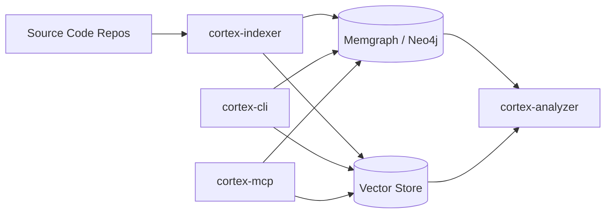

# CodeCortex

[](https://github.com/aloshkarev/codecortex)
[](https://opensource.org/licenses/MIT)
[](https://www.rust-lang.org/)

CodeCortex is a Rust-native code intelligence platform for local repositories and AI-agent workflows.

It combines:
- Graph indexing (symbols + relationships)
- Code analysis (call graph, complexity, smells, refactoring guidance)
- Hybrid retrieval (graph + vector)
- MCP server mode for AI assistants
- CLI workflows for developers and CI

## What You Get

- `cortex` CLI for indexing, querying, diagnostics, and interactive exploration
- MCP server with 40 tools for code-aware AI workflows
- Memgraph/Neo4j graph backend support
- Tree-sitter parsing for 10 languages
- Optional vector search with LanceDB/Qdrant
- Memory subsystem for persistent engineering observations

## Who This Is For

- Teams that want local/self-hosted code intelligence
- AI-heavy development workflows where symbol-level context matters
- Codebases where plain text search is not enough
- Engineers who want both CLI and MCP access to the same indexed data

## High-Level Architecture



## End-to-End Workflow

1. Start graph backend (usually Memgraph)
2. Build/install CodeCortex
3. Configure connection in `~/.cortex/config.toml`
4. Index repository with `cortex index <path>`
5. Query via CLI (`find`, `analyze`, `query`, `search`)
6. Expose the same indexed context to AI assistants via `cortex mcp start`

## Installation

### Fast Path

```bash
curl -fsSL https://raw.githubusercontent.com/aloshkarev/codecortex/main/quickstart.sh | bash
```

### Build from Source

```bash
git clone https://github.com/aloshkarev/codecortex.git
cd codecortex

cargo build --release -p cortex-cli
# binary: target/release/cortex-cli
```

### Make-Based Setup

```bash
make setup
```

### Full Install Docs

See [docs/INSTALL.md](docs/INSTALL.md).

## Prerequisites

- Rust stable toolchain
- Memgraph 3.x (recommended) or Neo4j-compatible backend
- Docker (recommended for local Memgraph)

## Quick Start (Memgraph + CLI)

```bash
# 1) Start Memgraph
docker run -d --name codecortex-memgraph -p 7687:7687 memgraph/memgraph:3.8.1

# 2) Configure connection (example)
cat > ~/.cortex/config.toml <<'CFG'
memgraph_uri = "memgraph://127.0.0.1:7687"
memgraph_user = ""
memgraph_password = ""
backend_type = "memgraph"
CFG

# 3) Verify runtime
cortex doctor

# 4) Index a repo
cortex index /path/to/repo --force

# 5) Query
cortex find name GraphClient
cortex analyze callers index_path
cortex query "MATCH (n:CodeNode) RETURN count(n) AS c"
```

Note: If your binary is not symlinked as `cortex`, run `target/release/cortex-cli`.

## Configuration Essentials

Typical keys in `~/.cortex/config.toml`:

```toml
memgraph_uri = "memgraph://127.0.0.1:7687"
memgraph_user = ""
memgraph_password = ""
backend_type = "memgraph" # or "neo4j"

max_batch_size = 500
indexer_timeout_secs = 300
indexer_max_files = 0
```

## CLI Usage Guide

Run full help:

```bash
cortex --help
```

Primary command families:

- Indexing/Repo: `index`, `list`, `delete`, `stats`, `watch`, `unwatch`
- Search/Analysis: `find`, `analyze`, `query`, `skeleton`, `signature`, `patterns`
- AI Context: `capsule`, `impact`, `refactor`, `test`, `diagnose`, `memory`
- Vector: `vector-index`, `search`
- MCP: `mcp start`, `mcp tools`
- Ops: `doctor`, `config`, `jobs`, `debug`, `completion`, `interactive`

### Interactive REPL

```bash
cortex interactive
```

Use `help` inside REPL to list supported interactive commands.

## MCP Mode (AI Assistant Integration)

Start MCP server over stdio:

```bash
cortex mcp start
```

List available tools:

```bash
cortex mcp tools
```

### Example MCP client config (Cursor/VSCode style)

```json
{
  "mcpServers": {
    "codecortex": {
      "command": "cortex",
      "args": ["mcp", "start"]
    }
  }
}
```

### MCP Tool Coverage (40 tools)

- Index/repository lifecycle
- Symbol/code search and signatures
- Impact graph and logic flow
- Refactoring and pattern analysis
- Health/diagnostics/job status
- Project and branch management
- Session memory
- LSP edge ingestion

## Crate-by-Crate Documentation

The workspace contains 11 crates. This section explains role, key APIs, and how each crate is used in practice.

| Crate | Purpose | Typically Used By |
|---|---|---|
| `cortex-core` | Shared types, config, errors, language/complexity helpers | All crates |
| `cortex-parser` | Tree-sitter parsing and signature extraction | `cortex-indexer`, `cortex-analyzer`, `cortex-mcp` |
| `cortex-graph` | Graph client, schema/migrations, query helpers, bundle I/O | `cortex-indexer`, `cortex-cli`, `cortex-mcp`, `cortex-analyzer` |
| `cortex-indexer` | Repository scanning, entity/edge extraction, graph write pipeline | `cortex-cli`, `cortex-mcp` |
| `cortex-analyzer` | Analysis queries, smell detection, coupling/cohesion, refactoring suggestions | `cortex-cli`, `cortex-mcp` |
| `cortex-watcher` | FS watching, debounce/filtering, project registry | `cortex-cli`, `cortex-mcp` |
| `cortex-vector` | Vector store abstraction + embedding providers + hybrid search | `cortex-cli`, `cortex-mcp` |
| `cortex-pipeline` | ECL pipeline (Extract → Cognify → Embed → Load) | Advanced programmatic flows |
| `cortex-mcp` | MCP server/tool router over CodeCortex primitives | AI assistants |
| `cortex-cli` | User-facing command runner and output formatting | Developers/CI |
| `cortex-benches` | Criterion benchmarks for retrieval/cache/impact workloads | Performance validation |

### `cortex-core`

- Defines `CodeNode`, `CodeEdge`, `Language`, `CortexConfig`, `CortexError`
- Provides language detection and complexity utilities
- Acts as stable contract layer between crates

### `cortex-parser`

- Parses Rust, Python, Go, TS/JS, C/C++, Java, PHP, Ruby
- Produces entities/signatures consumed by indexer/analyzer
- Tree-sitter based for fast, structured extraction

### `cortex-graph`

- Connects to Memgraph/Neo4j via Bolt
- Manages schema/indexes and query execution
- Supports graph bundle export/import (`.ccx` style)

### `cortex-indexer`

- Walks repository files and build metadata
- Extracts symbols/edges and writes to graph
- Supports force/incremental style flows and reports indexing metrics

### `cortex-analyzer`

- Query helpers: callers/callees/call chains/dependencies/dead code
- Smell detection modules: bloaters, couplers, dispensables, etc.
- Refactoring engine maps smells → recommended techniques with priority

### `cortex-watcher`

- Watches directories recursively
- Debounces noisy FS event streams
- Integrates project/branch context for re-index triggers

### `cortex-vector`

- `VectorStore` abstraction (`lancedb`, `json`, optional `qdrant` path)
- Embedders (OpenAI/Ollama)
- Hybrid graph+vector search entry points

### `cortex-pipeline`

- Structured processing pipeline:
  - Extract (parse)
  - Cognify (relationships/metrics)
  - Embed (vectorization)
  - Load (graph/vector persistence)

### `cortex-mcp`

- Exposes CodeCortex capabilities as MCP tools
- Uses `cortex-analyzer`, `cortex-indexer`, `cortex-graph`, `cortex-vector`, `cortex-watcher`
- Intended integration point for Cursor/Claude/VS Code agents

### `cortex-cli`

- Thin orchestration and UX layer over workspace crates
- Supports JSON/YAML/table output for scripts and CI
- Includes `doctor` and `debug` surfaces for operations

### `cortex-benches`

- Benchmarks capsule retrieval, impact graph, cache, TF-IDF/hybrid paths
- Useful for regression/perf budgets before release

## Graph Model (Conceptual)

Common nodes:

- `Repository`, `Directory`, `File`
- `Function`, `Struct`, `Enum`, `Trait`, `Class`, `Interface`, `Module`

Common edges:

- `CONTAINS`, `CALLS`, `IMPORTS`
- `INHERITS`, `IMPLEMENTS`
- parameter/definition relationships

## Language Support

- Rust
- Python
- Go
- TypeScript
- JavaScript
- C
- C++
- Java
- PHP
- Ruby

## Operational Playbook

### Re-index after major refactor

```bash
cortex index /path/to/repo --force
```

### Verify graph health

```bash
cortex doctor
cortex query "MATCH (n:CodeNode) RETURN count(n) AS c"
```

### Validate MCP surface

```bash
cortex mcp tools
```

### Vector workflow

```bash
cortex vector-index /path/to/repo --force
cortex search "how auth middleware handles token refresh"
```

## Comparison: CodeCortex vs `codegraphcontext` and Other OSS Solutions

This is a practical positioning comparison, not a benchmark shootout.

Comparison references (public docs):
- [CodeGraphContext docs](https://codegraphcontext.github.io/)
- [CodeGraphContext GitHub](https://github.com/Shashankss1205/CodeGraphContext)
- [Sourcegraph Cody docs](https://sourcegraph.com/docs/cody/core-concepts/code-graph)
- [OpenGrok](https://github.com/oracle/opengrok)
- [Glean](https://github.com/facebookincubator/Glean)

| Solution | Primary Focus | Data Model | AI Agent Integration | Strengths | Trade-offs |
|---|---|---|---|---|---|
| **CodeCortex** | Local/self-hosted code intelligence + MCP + CLI | Property graph + optional vectors | Native MCP server (`cortex mcp start`) | Unified indexing/analysis/MCP pipeline in one workspace; strong Rust modularity | Requires operating graph DB and indexing lifecycle |
| **CodeGraphContext** | MCP-first code graph context for assistants | Code graph DB | MCP server + CLI | Fast path to graph-backed assistant context and code relationship queries | Different scope/architecture choices; evaluate tool depth for your workflows |
| **Sourcegraph Cody** | Enterprise IDE assistant on Sourcegraph context stack | Search + code graph indexes in Sourcegraph platform | Cody clients/extensions (not MCP-first) | Mature IDE integrations and large-repo context workflows | Typically platform-centric deployment model |
| **OpenGrok** | Source browsing/search/cross-reference | Text/xref indexes (ctags + servlet stack) | No MCP-native flow | Battle-tested code search and navigation | Not designed as an MCP tool backend for agentic workflows |
| **Glean** | Large-scale language fact database/indexing | Rich fact store, language-specific schemas | Not MCP-native | Powerful semantic fact platform for large organizations | Heavier setup and steeper integration surface |

### How to Choose

Choose **CodeCortex** when you need:
- One local stack for CLI engineers and AI agents
- Graph + analysis + MCP in the same runtime
- Direct control of indexing and storage

Choose **CodeGraphContext** when you want:
- A focused MCP code graph context engine with its own setup/UX

Choose **OpenGrok/Glean/Sourcegraph stack** when your primary goal is:
- Existing enterprise search ecosystem (Sourcegraph/OpenGrok)
- Organization-wide fact platform at scale (Glean)

## Development

```bash
# Format
cargo fmt --all

# Lint
cargo clippy --all-targets --all-features

# Tests
cargo test --workspace

# Docs
cargo doc --workspace --no-deps
```

## Benchmarks

```bash
cargo bench
```

## Troubleshooting

### `Failed to connect to Memgraph`

- Check endpoint and protocol in config (`memgraph://` or `bolt://`)
- Verify container/service is running and port is reachable
- Run `cortex doctor`

### `Index finished but queries return little/no data`

- Re-run with force: `cortex index <path> --force`
- Confirm repository path used in filters matches indexed path
- Validate node count via `cortex query`

### `MCP client cannot see tools`

- Verify server starts: `cortex mcp start`
- Check client config command/args and environment
- Verify with `cortex mcp tools`

## Roadmap

See [docs/ROADMAP.md](docs/ROADMAP.md).

## License

MIT
