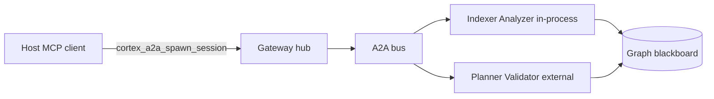
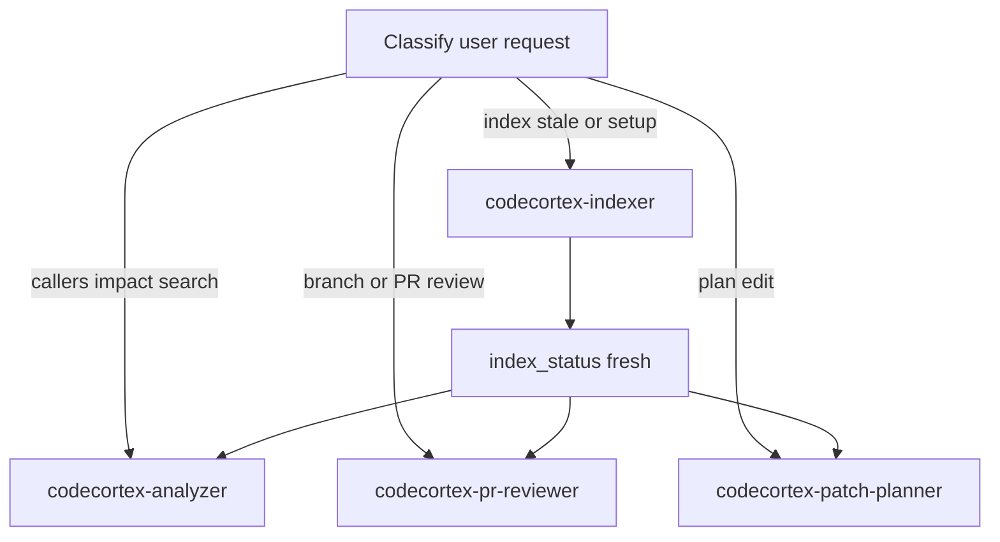

# CodeCortex subagents

Autonomous subagents for Cursor (Task tool) that run multi-step CodeCortex MCP workflows in isolation. Canonical definitions live here; Cursor discovers them via [`.cursor/agents/`](../../.cursor/agents/) symlinks.

## Prerequisites

1. **MCP:** `user-codecortex` enabled (`cortex mcp start` in `~/.cursor/mcp.json` — see [docs/INTEGRATION.md](../INTEGRATION.md)).
2. **Graph backend:** `cortex doctor` passes (FalkorDB default).
3. **Indexed repo:** at least one `cortex index <repo>` before analyzer / reviewer / planner tasks.

## Delegation matrix

| User intent | Subagent | Skill |
| --- | --- | --- |
| Stale/unknown index, setup, watch, jobs | [codecortex-indexer](codecortex-indexer.md) | [codecortex-indexing](../skills/codecortex-indexing/SKILL.md) |
| Callers, impact, dead code, complexity, NL search | [codecortex-analyzer](codecortex-analyzer.md) | [codecortex](../skills/codecortex/SKILL.md) |
| Branch or PR review before merge | [codecortex-pr-reviewer](codecortex-pr-reviewer.md) | [codecortex-workflows](../skills/codecortex-workflows/SKILL.md) |
| Plan edit before coding | [codecortex-patch-planner](codecortex-patch-planner.md) | [codecortex-workflows](../skills/codecortex-workflows/SKILL.md) |
| Local validation in A2A sessions | [codecortex-validator](codecortex-validator.md) | [codecortex-workflows](../skills/codecortex-workflows/SKILL.md) |

## A2A hybrid topology

Configure roles and HTTP in `~/.cortex/config.toml` — see [docs/A2A.md](../A2A.md).

## Parent orchestration

**Rules:**

- Run **codecortex-indexer** before impact-heavy analyzer/reviewer work when `freshness` is not fresh.
- Parent agent implements code changes; **codecortex-patch-planner** is read-only.
- Backend/DB/deploy questions → not CodeCortex; see `codecortex://guide/agent-platforms`.

## Skills vs subagents

| Mechanism | When |
| --- | --- |
| **Skill** | Parent agent inline routing (quick, single-turn) |
| **Subagent** | Long chains (10+ MCP calls), isolated context, strict tool boundaries |
| **MCP prompt** | `codecortex_patch_plan`, `codecortex_branch_review`, etc. — thin orchestration without full agent file |
| **Cursor rules** | Persistent `.cursor/rules/codecortex-*.mdc` — synced via [RULES-INDEX.md](../cursor/RULES-INDEX.md) |
| **Cursor hooks** | Advisory nudges at session/edit/Task — [docs/cursor/README.md](../cursor/README.md) |

## Invocation

Delegate via Cursor Task tool with the agent name, e.g.:

- `codecortex-indexer` — "Index is stale for /path/to/repo; repair and confirm freshness."
- `codecortex-pr-reviewer` — "Review branch feature/x against main."

Pass `repo_path`, branch names, `include_paths`, and task text in the prompt.

## Related docs

- [AGENTS.md](../../AGENTS.md) — repo-wide agent entry
- [docs/skills/](../skills/) — parent-agent skills
- MCP prompts and guides — `codecortex://guide/agent-workflows`
