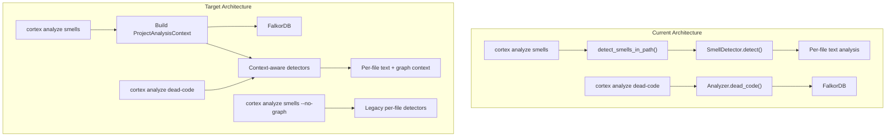

# Phase 1: Project-Aware Analysis

> Implementation spec for making all cortex analysis tools operate with full project context when running inside a project.

## Problem Statement

The static analysis layer (`SmellDetector`, `detect_dead_code`, `CouplingAnalyzer`, `DuplicationDetector`) operates on per-file source text and never queries the code graph. This produces false positives and logically incorrect results:

- `detect_dead_code` in `crates/cortex-analyzer/src/smells/dispensables.rs:256` extracts function definitions and calls from a single file. A function called from another file is reported as dead code.
- `detect_shotgun_surgery` in `crates/cortex-analyzer/src/smells/change_preventers.rs` counts callers within a single file, not project-wide.
- `detect_feature_envy` in `crates/cortex-analyzer/src/smells/couplers.rs` has no knowledge of module boundaries.
- `CouplingAnalyzer` requires manual `add_dependency()` instead of pulling from the graph.
- The graph-based `Analyzer::dead_code()` in `crates/cortex-analyzer/src/analyzer.rs:518` does use the call graph correctly, but the CLI routes `analyze smells` to the per-file detector.

The CLI function `detect_smells_in_path` (`crates/cortex-cli/src/main.rs:2893`) iterates files independently, running `detector.detect(&source, &file_path)` with zero cross-file context.

## Architecture



## 1.1 Introduce `ProjectAnalysisContext`

### New file: `crates/cortex-analyzer/src/context.rs`

This struct bridges static analysis with the graph. It is built once per analysis session by querying the graph and provides an in-memory lookup for cross-file relationships.

```rust
use std::collections::{HashMap, HashSet};
use std::sync::Arc;

use cortex_core::Result;
use cortex_graph::GraphClient;
use serde::{Deserialize, Serialize};

#[derive(Debug, Clone, Serialize, Deserialize)]
pub struct SymbolLocation {
    pub file_path: String,
    pub line_number: u32,
    pub kind: String,
}

#[derive(Debug, Clone, Default)]
pub struct ProjectSymbolIndex {
    /// function_name -> locations where it is defined
    pub definitions: HashMap<String, Vec<SymbolLocation>>,
    /// function_name -> set of function names that call it
    pub callers: HashMap<String, HashSet<String>>,
    /// function_name -> set of function names it calls
    pub callees: HashMap<String, HashSet<String>>,
    /// file_path -> list of imported module/symbol names
    pub imports: HashMap<String, Vec<String>>,
    /// module_name -> set of modules that depend on it
    pub module_dependents: HashMap<String, HashSet<String>>,
    /// module_name -> set of modules it depends on
    pub module_dependencies: HashMap<String, HashSet<String>>,
    /// All known function names across the project
    pub all_functions: HashSet<String>,
    /// All known type names (class, struct, trait, interface, enum)
    pub all_types: HashSet<String>,
}

#[derive(Clone)]
pub struct ProjectAnalysisContext {
    graph: GraphClient,
    repository_path: String,
    branch: Option<String>,
    symbols: Arc<ProjectSymbolIndex>,
}
```

### Construction

```rust
impl ProjectAnalysisContext {
    pub async fn build(
        graph: GraphClient,
        repository_path: String,
        branch: Option<String>,
    ) -> Result<Self> {
        let symbols = Arc::new(Self::load_symbol_index(&graph, &repository_path, branch.as_deref()).await?);
        Ok(Self { graph, repository_path, branch, symbols })
    }

    pub fn symbols(&self) -> &ProjectSymbolIndex { &self.symbols }
    pub fn repository_path(&self) -> &str { &self.repository_path }
    pub fn branch(&self) -> Option<&str> { self.branch.as_deref() }
    pub fn graph(&self) -> &GraphClient { &self.graph }
}
```

### Cypher queries for `load_symbol_index`

**Load all function definitions:**

```cypher
MATCH (f:Function)
WHERE f.repository_path = $repo
  AND ($branch IS NULL OR f.branch = $branch)
RETURN f.name AS name, f.path AS path, f.line_number AS line,
       f.kind AS kind
```

**Load all call relationships:**

```cypher
MATCH (caller:Function)-[:CALLS]->(callee:Function)
WHERE caller.repository_path = $repo
  AND ($branch IS NULL OR caller.branch = $branch)
RETURN caller.name AS caller_name, callee.name AS callee_name
```

**Load all import relationships:**

```cypher
MATCH (f:File)-[:IMPORTS]->(m)
WHERE f.repository_path = $repo
  AND ($branch IS NULL OR f.branch = $branch)
RETURN f.path AS file_path, m.name AS module_name
```

**Load module dependency relationships:**

```cypher
MATCH (a:Module)-[:IMPORTS]->(b:Module)
WHERE a.repository_path = $repo
  AND ($branch IS NULL OR a.branch = $branch)
RETURN a.name AS from_module, b.name AS to_module
```

**Load all type definitions:**

```cypher
MATCH (t:CodeNode)
WHERE t.repository_path = $repo
  AND ($branch IS NULL OR t.branch = $branch)
  AND t.kind IN ['CLASS', 'STRUCT', 'TRAIT', 'INTERFACE', 'ENUM']
RETURN t.name AS name, t.path AS path, t.line_number AS line, t.kind AS kind
```

### `ProjectSymbolIndex` helper methods

```rust
impl ProjectSymbolIndex {
    /// Returns true if the given function name has at least one caller
    /// from any file in the project.
    pub fn has_callers(&self, function_name: &str) -> bool {
        self.callers
            .get(function_name)
            .map_or(false, |c| !c.is_empty())
    }

    /// Returns the number of distinct callers for a function.
    pub fn caller_count(&self, function_name: &str) -> usize {
        self.callers.get(function_name).map_or(0, |c| c.len())
    }

    /// Returns true if the function is defined anywhere in the project.
    pub fn is_defined(&self, function_name: &str) -> bool {
        self.all_functions.contains(function_name)
    }

    /// Returns all files that import the given module.
    pub fn importers_of(&self, module_name: &str) -> Vec<&str> {
        self.imports
            .iter()
            .filter(|(_, modules)| modules.iter().any(|m| m == module_name))
            .map(|(file, _)| file.as_str())
            .collect()
    }

    /// Returns modules that depend on the given module.
    pub fn dependents_of(&self, module_name: &str) -> Option<&HashSet<String>> {
        self.module_dependents.get(module_name)
    }
}
```

### Files to modify

| File | Change |
|------|--------|
| `crates/cortex-analyzer/src/context.rs` | New file (above) |
| `crates/cortex-analyzer/src/lib.rs` | Add `pub mod context;` and re-export `ProjectAnalysisContext`, `ProjectSymbolIndex`, `SymbolLocation` |
| `crates/cortex-analyzer/Cargo.toml` | No changes needed (already depends on `cortex-graph`) |

---

## 1.2 Context-Aware Smell Detection

### New trait in `crates/cortex-analyzer/src/smells/mod.rs`

Add a companion function signature pattern. Rather than a trait (to preserve backward compatibility with the existing free-function API), each context-aware detector gets a new function with a `_with_context` suffix:

```rust
use crate::context::ProjectAnalysisContext;

// Existing:
pub fn detect_dead_code(source: &str, file_path: &str, config: &SmellConfig) -> Vec<CodeSmell>;

// New context-aware variant:
pub fn detect_dead_code_with_context(
    source: &str,
    file_path: &str,
    config: &SmellConfig,
    context: &ProjectAnalysisContext,
) -> Vec<CodeSmell>;
```

This pattern preserves the existing API and avoids breaking changes. The `_with_context` variants are the preferred path when a graph connection is available.

### Priority 1: `detect_dead_code_with_context`

**File:** `crates/cortex-analyzer/src/smells/dispensables.rs`

Current logic (line 256): extracts defined functions and called functions from the same file, reports any defined-but-not-called function as dead.

New logic:

```rust
pub fn detect_dead_code_with_context(
    source: &str,
    file_path: &str,
    _config: &SmellConfig,
    context: &ProjectAnalysisContext,
) -> Vec<CodeSmell> {
    let mut smells = Vec::new();
    let lines: Vec<&str> = source.lines().collect();
    let lang = SourceLanguage::from_file_path(file_path);

    let defined_functions = extract_defined_functions(&lines, lang);

    for (func_name, line_number) in &defined_functions {
        // Skip known entry points
        if is_entry_point(func_name) {
            continue;
        }

        // Check project-wide callers via the graph context
        if context.symbols().has_callers(func_name) {
            continue;
        }

        // Also check if it is called within the same file (local scope)
        let called_in_file = extract_all_function_calls(&lines, lang);
        if called_in_file.contains(func_name) {
            continue;
        }

        smells.push(CodeSmell {
            smell_type: SmellType::DeadCode,
            severity: Severity::Warning,
            file_path: file_path.to_string(),
            line_number: *line_number as u32,
            symbol_name: func_name.clone(),
            message: format!(
                "Function '{}' has no callers in the project",
                func_name
            ),
            metric_value: Some(0),
            threshold: Some(1),
            suggestion: Some(
                "Remove the function or add a caller. Verify it is not used via dynamic dispatch or reflection.".to_string()
            ),
        });
    }

    // Keep the existing unreachable-code-after-return detection unchanged
    detect_unreachable_code(&lines, file_path, &mut smells, lang);

    smells
}
```

### Priority 2: `detect_shotgun_surgery_with_context`

**File:** `crates/cortex-analyzer/src/smells/change_preventers.rs`

Current logic: counts callers within the same file. New logic queries the project-wide caller count:

```rust
pub fn detect_shotgun_surgery_with_context(
    source: &str,
    file_path: &str,
    config: &SmellConfig,
    context: &ProjectAnalysisContext,
) -> Vec<CodeSmell> {
    let mut smells = Vec::new();
    let lines: Vec<&str> = source.lines().collect();
    let lang = SourceLanguage::from_file_path(file_path);

    let defined_functions = extract_defined_functions(&lines, lang);

    for (func_name, line_number) in &defined_functions {
        let caller_count = context.symbols().caller_count(func_name);
        if caller_count >= config.min_shotgun_callers {
            smells.push(CodeSmell {
                smell_type: SmellType::ShotgunSurgery,
                severity: if caller_count > config.min_shotgun_callers * 2 {
                    Severity::Error
                } else {
                    Severity::Warning
                },
                file_path: file_path.to_string(),
                line_number: *line_number as u32,
                symbol_name: func_name.clone(),
                message: format!(
                    "Function '{}' is called from {} locations across the project. Changes here require shotgun surgery.",
                    func_name, caller_count
                ),
                metric_value: Some(caller_count),
                threshold: Some(config.min_shotgun_callers),
                suggestion: Some(
                    "Consider extracting shared logic into a common module or introducing an indirection layer.".to_string()
                ),
            });
        }
    }

    smells
}
```

### Priority 3: `detect_feature_envy_with_context`

**File:** `crates/cortex-analyzer/src/smells/couplers.rs`

Current logic: counts accesses to external objects within the same file. New logic uses the module dependency graph:

```rust
pub fn detect_feature_envy_with_context(
    source: &str,
    file_path: &str,
    config: &SmellConfig,
    context: &ProjectAnalysisContext,
) -> Vec<CodeSmell> {
    // Use existing per-file detection as a base
    let mut smells = detect_feature_envy(source, file_path, config);

    // Enrich: for each function defined in this file, check via graph
    // if it calls more functions from another module than from its own module
    let lines: Vec<&str> = source.lines().collect();
    let lang = SourceLanguage::from_file_path(file_path);
    let defined = extract_defined_functions(&lines, lang);
    let own_module = extract_module_from_path(file_path);

    for (func_name, line_number) in &defined {
        if let Some(callees) = context.symbols().callees.get(func_name) {
            let mut own_module_calls = 0usize;
            let mut other_module_calls: HashMap<String, usize> = HashMap::new();

            for callee in callees {
                if let Some(locations) = context.symbols().definitions.get(callee) {
                    for loc in locations {
                        let callee_module = extract_module_from_path(&loc.file_path);
                        if callee_module == own_module {
                            own_module_calls += 1;
                        } else {
                            *other_module_calls.entry(callee_module).or_default() += 1;
                        }
                    }
                }
            }

            for (other_module, count) in &other_module_calls {
                if *count > own_module_calls && *count >= config.min_other_accesses {
                    smells.push(CodeSmell {
                        smell_type: SmellType::FeatureEnvy,
                        severity: Severity::Warning,
                        file_path: file_path.to_string(),
                        line_number: *line_number as u32,
                        symbol_name: func_name.clone(),
                        message: format!(
                            "Function '{}' calls {} functions in module '{}' but only {} in its own module",
                            func_name, count, other_module, own_module_calls
                        ),
                        metric_value: Some(*count),
                        threshold: Some(config.min_other_accesses),
                        suggestion: Some(format!(
                            "Consider moving '{}' to module '{}'.",
                            func_name, other_module
                        )),
                    });
                }
            }
        }
    }

    smells.dedup_by(|a, b| {
        a.file_path == b.file_path
            && a.line_number == b.line_number
            && a.smell_type == b.smell_type
    });

    smells
}
```

### Priority 4: `detect_inappropriate_intimacy_with_context`

**File:** `crates/cortex-analyzer/src/smells/couplers.rs`

Similar enrichment: use the graph's import and call relationships to detect modules that are excessively coupled bi-directionally.

### Module-level exports

**File:** `crates/cortex-analyzer/src/smells/mod.rs`

Add re-exports:

```rust
pub use dispensables::detect_dead_code_with_context;
pub use change_preventers::detect_shotgun_surgery_with_context;
pub use couplers::{detect_feature_envy_with_context, detect_inappropriate_intimacy_with_context};
```

**File:** `crates/cortex-analyzer/src/lib.rs`

Add to the `pub use smells::` block:

```rust
pub use smells::{
    detect_dead_code_with_context,
    detect_shotgun_surgery_with_context,
    detect_feature_envy_with_context,
    detect_inappropriate_intimacy_with_context,
    // ... existing re-exports ...
};
```

---

## 1.3 Unify CLI Analysis Routing

### Changes to `crates/cortex-cli/src/main.rs`

#### A. Make `run_analyze_smells` async and context-aware

Current signature (line 2192):

```rust
fn run_analyze_smells(
    path: &str,
    min_severity: &str,
    max_files: usize,
    limit: usize,
    filters: &AnalyzePathFilters,
    format: OutputFormat,
) -> anyhow::Result<()>
```

New signature:

```rust
async fn run_analyze_smells(
    config: &CortexConfig,
    path: &str,
    min_severity: &str,
    max_files: usize,
    limit: usize,
    filters: &AnalyzePathFilters,
    format: OutputFormat,
    no_graph: bool,
) -> anyhow::Result<()>
```

New body (pseudocode):

```rust
async fn run_analyze_smells(
    config: &CortexConfig,
    path: &str,
    min_severity: &str,
    max_files: usize,
    limit: usize,
    filters: &AnalyzePathFilters,
    format: OutputFormat,
    no_graph: bool,
) -> anyhow::Result<()> {
    let severity = parse_severity(min_severity)?;
    filters.validate()?;

    // Attempt to build project context from graph
    let context = if !no_graph {
        match build_project_context(config).await {
            Ok(ctx) => Some(ctx),
            Err(e) => {
                if verbose_enabled() {
                    eprintln!("Warning: could not connect to graph, falling back to per-file analysis: {e}");
                }
                None
            }
        }
    } else {
        None
    };

    let mut scan = detect_smells_in_path_with_context(path, max_files, filters, context.as_ref())?;

    // ... rest unchanged: severity filter, sort, truncate, format output ...
}
```

#### B. New helper: `build_project_context`

```rust
async fn build_project_context(config: &CortexConfig) -> anyhow::Result<ProjectAnalysisContext> {
    let graph = GraphClient::connect(config).await?;
    let scope_root = default_project_scope_root()
        .ok_or_else(|| anyhow::anyhow!("Cannot determine project root"))?;
    let repo_path = normalize_scope_path_str(scope_root.to_string_lossy().as_ref());

    let branch = resolve_git_context(&scope_root)
        .map(|(_, branch, _)| branch);

    ProjectAnalysisContext::build(graph, repo_path, branch).await
        .map_err(|e| anyhow::anyhow!("Failed to build project context: {e}"))
}
```

#### C. New helper: `detect_smells_in_path_with_context`

```rust
fn detect_smells_in_path_with_context(
    path: &str,
    max_files: usize,
    filters: &AnalyzePathFilters,
    context: Option<&ProjectAnalysisContext>,
) -> anyhow::Result<SmellScanResult> {
    let root = PathBuf::from(path);
    if !root.exists() {
        anyhow::bail!("Path does not exist: {}", path);
    }

    let files = collect_analyzable_files(&root, max_files.max(1), filters)?;
    let detector = SmellDetector::new();
    let smell_config = SmellConfig::default();

    let mut files_scanned = 0usize;
    let mut files_skipped = 0usize;
    let mut read_errors = 0usize;
    let mut smells = Vec::new();

    for file in files {
        let metadata = match std::fs::metadata(&file) {
            Ok(meta) => meta,
            Err(_) => { read_errors += 1; continue; }
        };

        if metadata.len() > MAX_ANALYZE_FILE_BYTES {
            files_skipped += 1;
            continue;
        }

        match std::fs::read_to_string(&file) {
            Ok(source) => {
                files_scanned += 1;
                let file_path = file.display().to_string();

                // Run base detectors (always per-file)
                smells.extend(detector.detect(&source, &file_path));

                // Run context-aware detectors if context is available
                if let Some(ctx) = context {
                    smells.extend(detect_dead_code_with_context(
                        &source, &file_path, &smell_config, ctx,
                    ));
                    smells.extend(detect_shotgun_surgery_with_context(
                        &source, &file_path, &smell_config, ctx,
                    ));
                    smells.extend(detect_feature_envy_with_context(
                        &source, &file_path, &smell_config, ctx,
                    ));
                } else {
                    // Fall back to per-file variants
                    smells.extend(detect_dead_code(&source, &file_path, &smell_config));
                    smells.extend(detect_shotgun_surgery(&source, &file_path, &smell_config));
                    smells.extend(detect_feature_envy(&source, &file_path, &smell_config));
                }
            }
            Err(_) => { read_errors += 1; }
        }
    }

    Ok(SmellScanResult { files_scanned, files_skipped, read_errors, smells })
}
```

**Important**: The context-aware variants replace their per-file counterparts for the smells they cover. The base `detector.detect()` call runs the 6 built-in detectors (long functions, deep nesting, magic numbers, too many params, empty blocks, too many returns) which are inherently per-file and do not need project context. The context-aware variants handle DeadCode, ShotgunSurgery, and FeatureEnvy.

To avoid duplicates, either:
1. Remove `detect_dead_code`, `detect_shotgun_surgery`, `detect_feature_envy` from the non-context run in `SmellDetector::detect()` (those aren't actually called there today -- they're in the `smells/` submodule), or
2. Deduplicate by `(file_path, line_number, smell_type)` before returning.

Option 2 is safer for backward compatibility.

#### D. Add `--no-graph` flag to `AnalyzeCommand::Smells`

```rust
Smells {
    #[arg(default_value = ".")]
    path: String,
    #[arg(long, default_value = "info")]
    min_severity: String,
    #[arg(long, default_value_t = 1000)]
    max_files: usize,
    #[arg(long, default_value_t = 500)]
    limit: usize,
    /// Disable graph-backed project context (per-file only)
    #[arg(long)]
    no_graph: bool,
    #[command(flatten)]
    filters: AnalyzeFilterArgs,
},
```

#### E. Update the `run_analyze` match for `Smells`

Current (line 2018):

```rust
if let AnalyzeCommand::Smells { path, min_severity, max_files, limit, filters } = &command {
    return run_analyze_smells(path, min_severity, *max_files, *limit, &filters.to_filters(), format);
}
```

New:

```rust
if let AnalyzeCommand::Smells { path, min_severity, max_files, limit, no_graph, filters } = &command {
    return run_analyze_smells(
        config, path, min_severity, *max_files, *limit,
        &filters.to_filters(), format, *no_graph,
    ).await;
}
```

---

## 1.4 Auto-Populate `CouplingAnalyzer` from Graph

### File: `crates/cortex-analyzer/src/coupling.rs`

Add a new constructor:

```rust
use crate::context::ProjectAnalysisContext;

impl CouplingAnalyzer {
    /// Build a CouplingAnalyzer pre-populated with dependencies
    /// discovered from the project's code graph.
    pub fn from_context(context: &ProjectAnalysisContext) -> Self {
        let mut analyzer = Self::new();

        // Populate module dependencies
        for (module, deps) in &context.symbols().module_dependencies {
            for dep in deps {
                analyzer.add_dependency(module, dep);
            }
        }

        // Populate method-field access from callees
        // (approximation: function A calls function B in module M
        //  implies A accesses M's interface)
        for (func, callees) in &context.symbols().callees {
            for callee in callees {
                if let Some(locations) = context.symbols().definitions.get(callee) {
                    for loc in locations {
                        let module = extract_module_from_path(&loc.file_path);
                        analyzer.add_field_access(func, &module);
                    }
                }
            }
        }

        analyzer
    }
}
```

### CLI integration

In `cortex analyze smells` when context is available, auto-run coupling analysis:

```rust
if let Some(ctx) = &context {
    let coupling = CouplingAnalyzer::from_context(ctx);
    // Optionally include unstable modules / circular deps in output
}
```

---

## 1.5 Project-Wide Duplication Detection

### File: `crates/cortex-analyzer/src/duplication.rs`

```rust
use crate::context::ProjectAnalysisContext;

impl DuplicationDetector {
    /// Detect duplicates across all source files in the project.
    /// Reads file contents from disk using paths from the graph context.
    pub fn detect_project_wide(
        &self,
        context: &ProjectAnalysisContext,
    ) -> Vec<DuplicateBlock> {
        let mut sources: Vec<(String, String)> = Vec::new();

        for (file_path, _) in &context.symbols().definitions {
            // Deduplicate file paths (definitions map has symbol names as keys)
            // This is handled below by collecting unique file paths first
        }

        // Collect unique file paths from all definitions
        let mut file_paths: std::collections::HashSet<String> = std::collections::HashSet::new();
        for locations in context.symbols().definitions.values() {
            for loc in locations {
                file_paths.insert(loc.file_path.clone());
            }
        }

        for file_path in &file_paths {
            if let Ok(content) = std::fs::read_to_string(file_path) {
                sources.push((file_path.clone(), content));
            }
        }

        self.find_duplicates(&sources)
    }
}
```

---

## MCP Tool Updates

### File: `crates/cortex-mcp/src/handler.rs`

The `find_dead_code` tool should use project context:

```rust
#[tool(
    description = "Find functions or symbols that are never called (dead code). Uses project-wide call graph for accurate results."
)]
async fn find_dead_code(&self) -> Result<CallToolResult, McpError> {
    // Existing graph-based dead code detection is already project-aware
    let rows = Analyzer::new(self.graph_client().await?)
        .dead_code()
        .await
        .map_err(|e| McpError::internal_error(e.to_string(), None))?;
    Ok(Self::ok(
        serde_json::to_string_pretty(&rows).unwrap_or_default(),
    ))
}
```

The MCP `find_dead_code` already uses `Analyzer::dead_code()` which queries the graph. No change needed here. The fix is in the CLI `analyze smells` path, not MCP.

For a new MCP tool `analyze_smells` that uses context:

```rust
#[tool(
    description = "Detect code smells in the project with full project-wide context. More accurate than per-file detection for dead code, shotgun surgery, and feature envy."
)]
async fn analyze_smells(
    &self,
    Parameters(req): Parameters<AnalyzeSmellsReq>,
) -> Result<CallToolResult, McpError> {
    let graph = self.graph_client().await?;
    let project_ref = self.projects.get_current_project()
        .ok_or_else(|| McpError::invalid_params("No current project set", None))?;
    let repo_path = project_ref.path.display().to_string();
    let branch = Some(project_ref.branch.clone());

    let context = ProjectAnalysisContext::build(graph, repo_path, branch)
        .await
        .map_err(|e| McpError::internal_error(e.to_string(), None))?;

    let path = req.path.unwrap_or_else(|| ".".to_string());
    // ... run context-aware detection, return results ...
}
```

---

## Test Plan

### Unit tests

| Test | Location | What it verifies |
|------|----------|------------------|
| `test_dead_code_with_context_no_false_positive` | `dispensables.rs` | Function called from another file is NOT flagged as dead |
| `test_dead_code_with_context_true_dead` | `dispensables.rs` | Function with zero project-wide callers IS flagged |
| `test_shotgun_surgery_with_context` | `change_preventers.rs` | High caller count from graph triggers warning |
| `test_feature_envy_with_context` | `couplers.rs` | Cross-module call imbalance detected |
| `test_coupling_from_context` | `coupling.rs` | `CouplingAnalyzer::from_context` populates deps correctly |
| `test_project_wide_duplication` | `duplication.rs` | Cross-file duplicates found |

Each test should construct a `ProjectSymbolIndex` manually (no graph needed for unit tests):

```rust
#[cfg(test)]
fn mock_context_with_callers(callers: HashMap<String, HashSet<String>>) -> ProjectAnalysisContext {
    // Create a mock context with the given callers map
    // For unit tests, the graph client can be a no-op or test double
}
```

### Integration tests

| Test | What it verifies |
|------|------------------|
| `cortex analyze smells .` inside a Rust project | Context-aware dead code detection excludes cross-file calls |
| `cortex analyze smells --no-graph .` | Falls back to per-file detection |
| `cortex analyze smells .` without graph running | Gracefully falls back to per-file with warning |

---

## Migration Notes

- All existing `detect_*` function signatures are preserved unchanged.
- New `*_with_context` variants are additive; no breaking changes.
- The CLI `analyze smells` command gains `--no-graph` flag; default behavior changes to attempt graph context first, falling back silently.
- The `SmellDetector::detect()` method remains unchanged for callers that use it directly.
- `CouplingAnalyzer::new()` still works for manual population; `from_context` is additive.

## Verification Commands

```bash
cargo check -p cortex-analyzer
cargo test -p cortex-analyzer
cargo clippy -p cortex-analyzer -- -D warnings

cargo check -p cortex-cli
cargo test -p cortex-cli
cargo clippy -p cortex-cli -- -D warnings

# Integration test (requires running FalkorDB)
cortex index .
cortex analyze smells .
cortex analyze smells --no-graph .
cortex analyze dead-code
```
