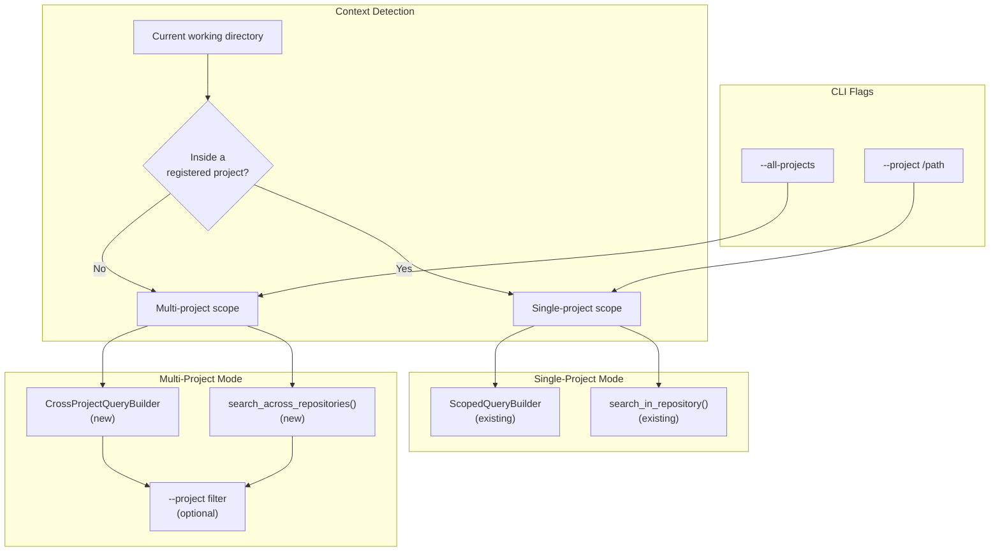

# Phase 2: Cross-Project Operations

> Implementation spec for enabling search, find, and analysis across all indexed projects when running cortex outside any known project, with optional project filtering.

## Problem Statement

Currently, every graph query and vector search is scoped to a single `repository_path`:

- `ScopedQueryBuilder` (`crates/cortex-graph/src/scoped_query.rs`) appends `WHERE n.repository_path = $repository_path AND n.branch = $branch` to all queries.
- `HybridSearch` (`crates/cortex-vector/src/hybrid.rs`) has `search_in_repository()` that filters by `repository` but no method for searching across multiple repositories.
- The CLI `default_project_scope_root()` (`crates/cortex-cli/src/main.rs:1910`) always resolves to a single project path. When outside a project, the scope falls back to the current directory's git root or the cwd itself.
- There are no tools for comparing codebases, finding similar functionality across projects, or detecting shared patterns.

## Architecture



## 2.1 Multi-Project Query Support in `cortex-graph`

### New file: `crates/cortex-graph/src/cross_project.rs`

```rust
use serde_json::Value;
use cortex_core::Result;
use crate::GraphClient;

/// Query builder that operates across multiple repositories,
/// removing the single-repository scope constraint.
#[derive(Debug, Clone)]
pub struct CrossProjectQueryBuilder {
    /// If None, queries all repositories. If Some, only these.
    repositories: Option<Vec<String>>,
    /// Optional branch filter. If None, queries all branches.
    branch_filter: Option<String>,
}

impl CrossProjectQueryBuilder {
    pub fn all() -> Self {
        Self {
            repositories: None,
            branch_filter: None,
        }
    }

    pub fn with_repositories(repositories: Vec<String>) -> Self {
        Self {
            repositories: Some(repositories),
            branch_filter: None,
        }
    }

    pub fn with_branch(mut self, branch: String) -> Self {
        self.branch_filter = Some(branch);
        self
    }

    /// Build the WHERE clause for repository/branch filtering.
    /// Returns (where_fragment, params) to be embedded in a Cypher query.
    pub fn build_scope_where(&self, node_var: &str) -> (String, Vec<(&str, Value)>) {
        let mut conditions = Vec::new();
        let mut params: Vec<(&str, Value)> = Vec::new();

        if let Some(repos) = &self.repositories {
            conditions.push(format!("{}.repository_path IN $repositories", node_var));
            params.push(("repositories", Value::Array(
                repos.iter().map(|r| Value::String(r.clone())).collect()
            )));
        }

        if let Some(branch) = &self.branch_filter {
            conditions.push(format!("{}.branch = $branch_filter", node_var));
            params.push(("branch_filter", Value::String(branch.clone())));
        }

        let where_clause = if conditions.is_empty() {
            String::new()
        } else {
            format!("WHERE {}", conditions.join(" AND "))
        };

        (where_clause, params)
    }
}
```

### Cross-project query methods

Add methods to `CrossProjectQueryBuilder` for the most common cross-project operations:

```rust
impl CrossProjectQueryBuilder {
    /// Find symbols by name across all (or filtered) repositories.
    /// Returns results grouped by repository.
    pub async fn find_by_name(
        &self,
        client: &GraphClient,
        name: &str,
    ) -> Result<Vec<Value>> {
        let (where_clause, mut params) = self.build_scope_where("n");
        let name_condition = if where_clause.is_empty() {
            "WHERE n.name CONTAINS $name"
        } else {
            "AND n.name CONTAINS $name"
        };

        let cypher = format!(
            "MATCH (n:CodeNode)
             {where_clause} {name_condition}
             RETURN n.name AS name, n.kind AS kind, n.path AS path,
                    n.line_number AS line, n.repository_path AS repository,
                    n.branch AS branch, coalesce(n.lang, '') AS language
             ORDER BY n.repository_path, n.name
             LIMIT 200"
        );

        params.push(("name", Value::String(name.to_string())));
        // Execute with params...
        client.raw_query(&cypher).await
    }

    /// Find dead code across all repositories.
    pub async fn dead_code_cross_project(
        &self,
        client: &GraphClient,
    ) -> Result<Vec<Value>> {
        let (where_clause, _params) = self.build_scope_where("f");

        let cypher = format!(
            "MATCH (f:Function)
             {where_clause}
             OPTIONAL MATCH (caller:Function)-[:CALLS]->(f)
             WITH f, count(caller) AS incoming
             WHERE incoming = 0
               AND NOT f.name IN ['main', '__init__', '__main__', 'new', 'default', 'drop']
             RETURN f.name AS function, f.path AS path,
                    f.repository_path AS repository, f.branch AS branch,
                    f.line_number AS line, 'no incoming calls' AS reason
             ORDER BY f.repository_path, f.path, f.name
             LIMIT 500"
        );

        client.raw_query(&cypher).await
    }

    /// Find functions with the same name across different repositories.
    /// Useful for detecting shared/duplicated functionality.
    pub async fn find_similar_across_repos(
        &self,
        client: &GraphClient,
        min_repos: usize,
    ) -> Result<Vec<Value>> {
        let cypher = format!(
            "MATCH (f:Function)
             WITH f.name AS name, collect(DISTINCT f.repository_path) AS repos,
                  collect({{path: f.path, repo: f.repository_path, line: f.line_number}}) AS locations
             WHERE size(repos) >= $min_repos
             RETURN name, size(repos) AS repo_count, repos, locations
             ORDER BY repo_count DESC, name
             LIMIT 100"
        );

        client.query_with_param(&cypher, "min_repos", &min_repos.to_string()).await
    }

    /// Compare two repositories: find functions that exist in both.
    pub async fn compare_repositories(
        &self,
        client: &GraphClient,
        repo_a: &str,
        repo_b: &str,
    ) -> Result<Vec<Value>> {
        let cypher =
            "MATCH (a:Function {repository_path: $repo_a})
             MATCH (b:Function {repository_path: $repo_b})
             WHERE a.name = b.name
             RETURN a.name AS function_name,
                    a.path AS path_a, a.line_number AS line_a,
                    b.path AS path_b, b.line_number AS line_b,
                    coalesce(a.lang, '') AS language
             ORDER BY a.name
             LIMIT 200";

        client.query_with_params(
            cypher,
            vec![("repo_a", repo_a.to_string()), ("repo_b", repo_b.to_string())],
        ).await
    }

    /// List all indexed repositories with symbol counts.
    pub async fn list_repositories_with_stats(
        &self,
        client: &GraphClient,
    ) -> Result<Vec<Value>> {
        let cypher =
            "MATCH (n:CodeNode)
             WITH n.repository_path AS repo, n.branch AS branch,
                  count(n) AS symbol_count,
                  count(CASE WHEN n.kind = 'FUNCTION' THEN 1 END) AS functions,
                  count(CASE WHEN n.kind = 'CLASS' THEN 1 END) AS classes
             RETURN repo, branch, symbol_count, functions, classes
             ORDER BY repo, branch";

        client.raw_query(cypher).await
    }
}
```

### Module registration

**File:** `crates/cortex-graph/src/lib.rs`

```rust
pub mod cross_project;
pub use cross_project::CrossProjectQueryBuilder;
```

---

## 2.2 Cross-Project Search in Vector Store

### File: `crates/cortex-vector/src/hybrid.rs`

Add new methods to `HybridSearch`:

```rust
impl HybridSearch {
    /// Search across all repositories or a filtered subset.
    /// When `repositories` is None, searches everything.
    /// When `repositories` is Some, filters to those repos only.
    pub async fn search_across_repositories(
        &self,
        query: &str,
        repositories: Option<&[String]>,
        k: usize,
    ) -> Result<Vec<HybridResult>, crate::VectorError> {
        let embedding = self.embedder.embed(query).await?;

        let results = match repositories {
            Some(repos) if repos.len() == 1 => {
                let mut filter = HashMap::new();
                filter.insert(
                    "repository".to_string(),
                    MetadataValue::String(repos[0].clone()),
                );
                self.vector_store.search_with_filter(embedding, k * 3, filter).await?
            }
            Some(repos) => {
                // Search without filter, then post-filter by repositories
                let all_results = self.vector_store.search(embedding, k * 3 * repos.len()).await?;
                all_results
                    .into_iter()
                    .filter(|r| {
                        r.metadata
                            .get("repository")
                            .and_then(|v| match v {
                                MetadataValue::String(s) => Some(s.as_str()),
                                _ => None,
                            })
                            .map_or(false, |repo| repos.iter().any(|r| r == repo))
                    })
                    .collect()
            }
            None => {
                // No repository filter: global search
                self.vector_store.search(embedding, k * 3).await?
            }
        };

        let mut hybrid_results: Vec<HybridResult> = results
            .into_iter()
            .map(|r| HybridResult {
                combined_score: r.score,
                result: r,
                graph_context: None,
            })
            .collect();

        hybrid_results.sort_by(|a, b| {
            b.combined_score
                .partial_cmp(&a.combined_score)
                .unwrap_or(std::cmp::Ordering::Equal)
        });
        hybrid_results.truncate(k);

        Ok(hybrid_results)
    }

    /// Find similar code across projects.
    /// Given a symbol name in one repo, find similar symbols in other repos.
    pub async fn find_similar_across_projects(
        &self,
        query: &str,
        source_repo: &str,
        k: usize,
    ) -> Result<Vec<HybridResult>, crate::VectorError> {
        let embedding = self.embedder.embed(query).await?;
        let all_results = self.vector_store.search(embedding, k * 5).await?;

        let mut cross_project: Vec<HybridResult> = all_results
            .into_iter()
            .filter(|r| {
                r.metadata
                    .get("repository")
                    .and_then(|v| match v {
                        MetadataValue::String(s) => Some(s.as_str()),
                        _ => None,
                    })
                    .map_or(true, |repo| repo != source_repo)
            })
            .map(|r| HybridResult {
                combined_score: r.score,
                result: r,
                graph_context: None,
            })
            .collect();

        cross_project.sort_by(|a, b| {
            b.combined_score
                .partial_cmp(&a.combined_score)
                .unwrap_or(std::cmp::Ordering::Equal)
        });
        cross_project.truncate(k);

        Ok(cross_project)
    }

    /// Search within a specific repository AND branch.
    pub async fn search_in_repository_and_branch(
        &self,
        query: &str,
        repository: &str,
        branch: &str,
        k: usize,
    ) -> Result<Vec<HybridResult>, crate::VectorError> {
        let embedding = self.embedder.embed(query).await?;
        let mut filter = HashMap::new();
        filter.insert(
            "repository".to_string(),
            MetadataValue::String(repository.to_string()),
        );
        filter.insert(
            "branch".to_string(),
            MetadataValue::String(branch.to_string()),
        );

        let results = self.vector_store.search_with_filter(embedding, k, filter).await?;

        Ok(results
            .into_iter()
            .map(|r| HybridResult {
                combined_score: r.score,
                result: r,
                graph_context: None,
            })
            .collect())
    }
}
```

---

## 2.3 CLI Mode Detection and Routing

### Global flags

**File:** `crates/cortex-cli/src/main.rs`

Add to the top-level `Cli` struct:

```rust
#[derive(Debug, Parser)]
#[command(name = "cortex", version, about)]
struct Cli {
    #[arg(long, value_enum, default_value_t = OutputFormat::Json)]
    format: OutputFormat,

    #[arg(short, long)]
    verbose: bool,

    /// Search/analyze across all indexed projects (overrides project detection)
    #[arg(long, global = true)]
    all_projects: bool,

    /// Explicitly scope to a specific project path
    #[arg(long, global = true)]
    project: Option<PathBuf>,

    #[command(subcommand)]
    command: Commands,
}
```

### Scope resolution logic

New enum and resolver:

```rust
#[derive(Debug, Clone)]
enum ProjectScope {
    /// Inside a known project: scope all queries to it
    SingleProject {
        repository_path: String,
        branch: Option<String>,
    },
    /// Outside all projects, or --all-projects: query everything
    AllProjects {
        /// Optional subset of repositories to include
        repository_filter: Option<Vec<String>>,
    },
    /// Explicit project override via --project flag
    ExplicitProject {
        repository_path: String,
        branch: Option<String>,
    },
}

fn resolve_project_scope(cli: &Cli) -> ProjectScope {
    // 1. --all-projects flag takes precedence
    if cli.all_projects {
        return ProjectScope::AllProjects {
            repository_filter: None,
        };
    }

    // 2. --project flag overrides detection
    if let Some(project_path) = &cli.project {
        let repo_path = normalize_scope_path_str(project_path.to_string_lossy().as_ref());
        let branch = resolve_git_context(project_path).map(|(_, b, _)| b);
        return ProjectScope::ExplicitProject {
            repository_path: repo_path,
            branch,
        };
    }

    // 3. Auto-detect: check project registry, then git root
    let registry = cortex_watcher::ProjectRegistry::new();
    if let Some(project) = registry.get_current_project() {
        return ProjectScope::SingleProject {
            repository_path: normalize_scope_path_str(
                project.path.to_string_lossy().as_ref(),
            ),
            branch: Some(project.branch),
        };
    }

    let cwd = std::env::current_dir().unwrap_or_default();
    if let Some(git_root) = find_git_repository_root(&cwd) {
        // Check if this git root is a registered project
        if registry.get_project(&git_root).is_some() {
            let branch = resolve_git_context(&git_root).map(|(_, b, _)| b);
            return ProjectScope::SingleProject {
                repository_path: normalize_scope_path_str(
                    git_root.to_string_lossy().as_ref(),
                ),
                branch,
            };
        }
    }

    // Outside any project: default to all-projects mode
    ProjectScope::AllProjects {
        repository_filter: None,
    }
}
```

### Updated `run_find` dispatch

```rust
async fn run_find(
    config: &CortexConfig,
    command: FindCommand,
    format: OutputFormat,
    scope: &ProjectScope,
) -> anyhow::Result<()> {
    let graph = GraphClient::connect(config).await?;

    match scope {
        ProjectScope::SingleProject { repository_path, .. }
        | ProjectScope::ExplicitProject { repository_path, .. } => {
            // Existing behavior: scope to single project
            let analyzer = Analyzer::new(graph);
            let filters = AnalyzePathFilters {
                include_paths: vec![repository_path.clone()],
                ..Default::default()
            };
            // ... dispatch to analyzer with filters ...
        }

        ProjectScope::AllProjects { repository_filter } => {
            // New: cross-project search
            let cross = match repository_filter {
                Some(repos) => CrossProjectQueryBuilder::with_repositories(repos.clone()),
                None => CrossProjectQueryBuilder::all(),
            };
            let results = cross.find_by_name(&graph, &extract_query(&command)).await?;
            // Group results by repository for display
            print_cross_project_results(format, &results)?;
        }
    }

    Ok(())
}
```

### Output grouping for cross-project results

When displaying cross-project results, group by repository:

```rust
fn print_cross_project_results(
    format: OutputFormat,
    results: &[Value],
) -> anyhow::Result<()> {
    let mut by_repo: BTreeMap<String, Vec<&Value>> = BTreeMap::new();
    for result in results {
        let repo = result
            .get("repository")
            .and_then(|v| v.as_str())
            .unwrap_or("unknown");
        by_repo.entry(repo.to_string()).or_default().push(result);
    }

    let output = serde_json::json!({
        "mode": "cross-project",
        "total_results": results.len(),
        "repositories": by_repo.len(),
        "results_by_repository": by_repo,
    });

    print_formatted(format, &output)?;
    Ok(())
}
```

### Updated `run_search` dispatch

```rust
async fn run_search(
    config: &CortexConfig,
    query: &str,
    limit: usize,
    search_type: &str,
    scope: &ProjectScope,
    // ... other args ...
    format: OutputFormat,
) -> anyhow::Result<()> {
    let store = open_vector_store(config)?;
    let embedder = create_embedder(config)?;
    let hybrid = HybridSearch::new(store, embedder);

    match scope {
        ProjectScope::SingleProject { repository_path, branch }
        | ProjectScope::ExplicitProject { repository_path, branch } => {
            let results = match branch {
                Some(b) => hybrid.search_in_repository_and_branch(query, repository_path, b, limit).await?,
                None => hybrid.search_in_repository(query, repository_path, limit).await?,
            };
            // ... format and print ...
        }

        ProjectScope::AllProjects { repository_filter } => {
            let repos = repository_filter.as_deref();
            let results = hybrid.search_across_repositories(query, repos, limit).await?;
            // ... format and print grouped by repo ...
        }
    }

    Ok(())
}
```

---

## 2.4 Cross-Project Analysis Tools

### New file: `crates/cortex-analyzer/src/cross_project.rs`

```rust
use cortex_core::Result;
use cortex_graph::{CrossProjectQueryBuilder, GraphClient};
use serde::{Deserialize, Serialize};
use serde_json::Value;

#[derive(Debug, Clone, Serialize, Deserialize)]
pub struct CrossProjectMatch {
    pub function_name: String,
    pub repositories: Vec<String>,
    pub locations: Vec<CrossProjectLocation>,
}

#[derive(Debug, Clone, Serialize, Deserialize)]
pub struct CrossProjectLocation {
    pub repository: String,
    pub path: String,
    pub line_number: u32,
}

#[derive(Debug, Clone, Serialize, Deserialize)]
pub struct SharedDependency {
    pub module_name: String,
    pub repositories: Vec<String>,
    pub usage_count: usize,
}

#[derive(Debug, Clone, Serialize, Deserialize)]
pub struct ApiSurfaceComparison {
    pub repo_a: String,
    pub repo_b: String,
    pub shared_functions: Vec<String>,
    pub unique_to_a: Vec<String>,
    pub unique_to_b: Vec<String>,
    pub similarity_score: f64,
}

pub struct CrossProjectAnalyzer {
    graph: GraphClient,
}

impl CrossProjectAnalyzer {
    pub fn new(graph: GraphClient) -> Self {
        Self { graph }
    }

    /// Find functions/symbols that exist in multiple repositories.
    pub async fn find_similar_symbols(
        &self,
        min_repos: usize,
    ) -> Result<Vec<CrossProjectMatch>> {
        let builder = CrossProjectQueryBuilder::all();
        let rows = builder.find_similar_across_repos(&self.graph, min_repos).await?;
        // Parse rows into CrossProjectMatch structs
        Ok(parse_cross_project_matches(rows))
    }

    /// Find shared import dependencies between repositories.
    pub async fn find_shared_dependencies(
        &self,
        repos: Option<&[String]>,
    ) -> Result<Vec<SharedDependency>> {
        let cypher =
            "MATCH (f:File)-[:IMPORTS]->(m)
             WITH m.name AS module, collect(DISTINCT f.repository_path) AS repos
             WHERE size(repos) >= 2
             RETURN module, repos, size(repos) AS repo_count
             ORDER BY repo_count DESC
             LIMIT 100";

        let rows = self.graph.raw_query(cypher).await?;
        Ok(parse_shared_dependencies(rows, repos))
    }

    /// Compare public API surface between two repositories.
    pub async fn compare_api_surface(
        &self,
        repo_a: &str,
        repo_b: &str,
    ) -> Result<ApiSurfaceComparison> {
        let builder = CrossProjectQueryBuilder::all();
        let shared = builder.compare_repositories(&self.graph, repo_a, repo_b).await?;

        // Get all functions from each repo
        let funcs_a = self.get_public_functions(repo_a).await?;
        let funcs_b = self.get_public_functions(repo_b).await?;

        let shared_names: Vec<String> = shared
            .iter()
            .filter_map(|v| v.get("function_name").and_then(|n| n.as_str()))
            .map(String::from)
            .collect();

        let shared_set: std::collections::HashSet<&str> =
            shared_names.iter().map(|s| s.as_str()).collect();

        let unique_a: Vec<String> = funcs_a
            .iter()
            .filter(|f| !shared_set.contains(f.as_str()))
            .cloned()
            .collect();

        let unique_b: Vec<String> = funcs_b
            .iter()
            .filter(|f| !shared_set.contains(f.as_str()))
            .cloned()
            .collect();

        let total = funcs_a.len() + funcs_b.len();
        let similarity = if total > 0 {
            (shared_names.len() as f64 * 2.0) / total as f64
        } else {
            0.0
        };

        Ok(ApiSurfaceComparison {
            repo_a: repo_a.to_string(),
            repo_b: repo_b.to_string(),
            shared_functions: shared_names,
            unique_to_a: unique_a,
            unique_to_b: unique_b,
            similarity_score: similarity,
        })
    }

    async fn get_public_functions(&self, repo: &str) -> Result<Vec<String>> {
        let rows = self
            .graph
            .query_with_param(
                "MATCH (f:Function {repository_path: $repo})
                 WHERE f.visibility IS NULL OR f.visibility = 'public' OR f.visibility = 'pub'
                 RETURN f.name AS name
                 ORDER BY f.name",
                "repo",
                repo,
            )
            .await?;

        Ok(rows
            .iter()
            .filter_map(|v| v.get("name").and_then(|n| n.as_str()))
            .map(String::from)
            .collect())
    }
}
```

### New CLI subcommands

**File:** `crates/cortex-cli/src/main.rs`

Add new variants to `AnalyzeCommand`:

```rust
AnalyzeCommand::Similar {
    /// Symbol name to find across projects
    symbol: String,
    /// Minimum number of repositories the symbol must appear in
    #[arg(long, default_value_t = 2)]
    min_repos: usize,
},
AnalyzeCommand::SharedDeps {
    /// Optional: compare only these repositories
    #[arg(long, value_delimiter = ',')]
    repos: Vec<String>,
},
AnalyzeCommand::CompareApi {
    /// First repository path
    repo_a: String,
    /// Second repository path
    repo_b: String,
},
```

Usage examples:

```bash
# Find functions that exist in 3+ projects
cortex analyze similar --symbol "parse" --min-repos 3

# Find shared dependencies across all projects
cortex analyze shared-deps

# Compare API surfaces
cortex analyze compare-api /path/to/project-a /path/to/project-b

# Search across all projects
cortex find name "UserService" --all-projects

# Search across specific projects
cortex --project /path/to/repo find name "UserService"

# Semantic search across all projects
cortex search "error handling middleware" --all-projects
```

### New MCP tools

**File:** `crates/cortex-mcp/src/handler.rs`

```rust
#[tool(
    description = "Find similar functions or symbols across multiple indexed repositories. Use when comparing codebases or finding duplicated functionality."
)]
async fn find_similar_across_projects(
    &self,
    Parameters(req): Parameters<SimilarAcrossReq>,
) -> Result<CallToolResult, McpError> {
    let graph = self.graph_client().await?;
    let analyzer = CrossProjectAnalyzer::new(graph);
    let results = analyzer
        .find_similar_symbols(req.min_repos.unwrap_or(2))
        .await
        .map_err(|e| McpError::internal_error(e.to_string(), None))?;
    Ok(Self::ok(serde_json::to_string_pretty(&results).unwrap_or_default()))
}

#[tool(
    description = "Find shared dependencies between indexed projects. Shows modules imported by multiple repositories."
)]
async fn find_shared_dependencies(
    &self,
    Parameters(req): Parameters<SharedDepsReq>,
) -> Result<CallToolResult, McpError> {
    let graph = self.graph_client().await?;
    let analyzer = CrossProjectAnalyzer::new(graph);
    let repos = if req.repos.is_empty() { None } else { Some(req.repos.as_slice()) };
    let results = analyzer
        .find_shared_dependencies(repos)
        .await
        .map_err(|e| McpError::internal_error(e.to_string(), None))?;
    Ok(Self::ok(serde_json::to_string_pretty(&results).unwrap_or_default()))
}

#[tool(
    description = "Compare public API surfaces between two repositories. Shows shared functions, unique functions, and a similarity score."
)]
async fn compare_api_surface(
    &self,
    Parameters(req): Parameters<CompareApiReq>,
) -> Result<CallToolResult, McpError> {
    let graph = self.graph_client().await?;
    let analyzer = CrossProjectAnalyzer::new(graph);
    let result = analyzer
        .compare_api_surface(&req.repo_a, &req.repo_b)
        .await
        .map_err(|e| McpError::internal_error(e.to_string(), None))?;
    Ok(Self::ok(serde_json::to_string_pretty(&result).unwrap_or_default()))
}

#[tool(
    description = "Search code across all indexed repositories using vector embeddings. Returns results grouped by repository."
)]
async fn search_across_projects(
    &self,
    Parameters(req): Parameters<CrossProjectSearchReq>,
) -> Result<CallToolResult, McpError> {
    let store = self.open_vector_store()?;
    let embedder = self.create_embedder()?;
    let hybrid = HybridSearch::new(store, embedder);
    let repos = if req.repositories.is_empty() {
        None
    } else {
        Some(req.repositories.as_slice())
    };
    let results = hybrid
        .search_across_repositories(&req.query, repos, req.limit.unwrap_or(10))
        .await
        .map_err(|e| McpError::internal_error(e.to_string(), None))?;
    Ok(Self::ok(serde_json::to_string_pretty(&results).unwrap_or_default()))
}
```

Register in `tool_names()`:

```rust
pub fn tool_names() -> &'static [&'static str] {
    &[
        // ... existing tools ...
        "find_similar_across_projects",
        "find_shared_dependencies",
        "compare_api_surface",
        "search_across_projects",
    ]
}
```

---

## Files Summary

| File | Change Type | Description |
|------|-------------|-------------|
| `crates/cortex-graph/src/cross_project.rs` | New | `CrossProjectQueryBuilder` with multi-repo Cypher queries |
| `crates/cortex-graph/src/lib.rs` | Edit | Add `pub mod cross_project` and re-export |
| `crates/cortex-vector/src/hybrid.rs` | Edit | Add `search_across_repositories`, `find_similar_across_projects`, `search_in_repository_and_branch` |
| `crates/cortex-analyzer/src/cross_project.rs` | New | `CrossProjectAnalyzer` with similarity, shared deps, API comparison |
| `crates/cortex-analyzer/src/lib.rs` | Edit | Add `pub mod cross_project` and re-exports |
| `crates/cortex-cli/src/main.rs` | Edit | Add `--all-projects`, `--project` global flags; `ProjectScope` enum; update `run_find`, `run_search`, `run_analyze`; add `Similar`, `SharedDeps`, `CompareApi` subcommands |
| `crates/cortex-mcp/src/handler.rs` | Edit | Add 4 new cross-project MCP tools |
| `crates/cortex-mcp/src/lib.rs` | Edit | Add new tool names to `tool_names()` |

---

## Test Plan

### Unit tests

| Test | File | What it verifies |
|------|------|------------------|
| `test_cross_project_query_builder_all` | `cross_project.rs` | No WHERE clause when querying all repos |
| `test_cross_project_query_builder_filtered` | `cross_project.rs` | WHERE clause includes repository list |
| `test_cross_project_query_builder_with_branch` | `cross_project.rs` | Branch filter appended |
| `test_project_scope_resolution_inside` | `main.rs` | Detects SingleProject when in registered project |
| `test_project_scope_resolution_outside` | `main.rs` | Detects AllProjects when outside any project |
| `test_project_scope_all_flag` | `main.rs` | `--all-projects` overrides to AllProjects |
| `test_project_scope_explicit` | `main.rs` | `--project` overrides to ExplicitProject |
| `test_search_across_repositories` | `hybrid.rs` | Vector search without repo filter returns all |
| `test_search_across_repositories_filtered` | `hybrid.rs` | Vector search with repo filter returns subset |

### Integration tests

| Test | What it verifies |
|------|------------------|
| Index two different OSS fixtures, run `cortex find name "main" --all-projects` | Cross-project find returns results from both repos |
| Index two fixtures, run `cortex analyze similar --symbol "parse"` | Shared function detection works |
| Index two fixtures, run `cortex analyze compare-api repo_a repo_b` | API comparison returns shared/unique functions |
| Run `cortex search "error handling" --all-projects` | Vector search spans repos |

---

## Migration Notes

- `--all-projects` and `--project` are additive global flags; no existing behavior changes.
- When neither flag is set and the user is inside a project, behavior is identical to today (single-project scope).
- When outside a project and neither flag is set, behavior changes from "scope to cwd" to "search all projects." This is a more useful default. To preserve old behavior, use `--project .`.
- The `CrossProjectQueryBuilder` is independent of `ScopedQueryBuilder`; both coexist.
- New MCP tools are additive; existing tools unchanged.

## Verification Commands

```bash
cargo check -p cortex-graph
cargo test -p cortex-graph
cargo check -p cortex-vector
cargo test -p cortex-vector
cargo check -p cortex-analyzer
cargo test -p cortex-analyzer
cargo check -p cortex-cli
cargo test -p cortex-cli
cargo clippy --workspace -- -D warnings

# Integration (requires FalkorDB + two indexed repos)
cortex index /path/to/repo-a
cortex index /path/to/repo-b
cortex find name "main" --all-projects
cortex analyze similar --symbol "parse" --min-repos 2
cortex analyze compare-api /path/to/repo-a /path/to/repo-b
cortex search "error handling" --all-projects
```
