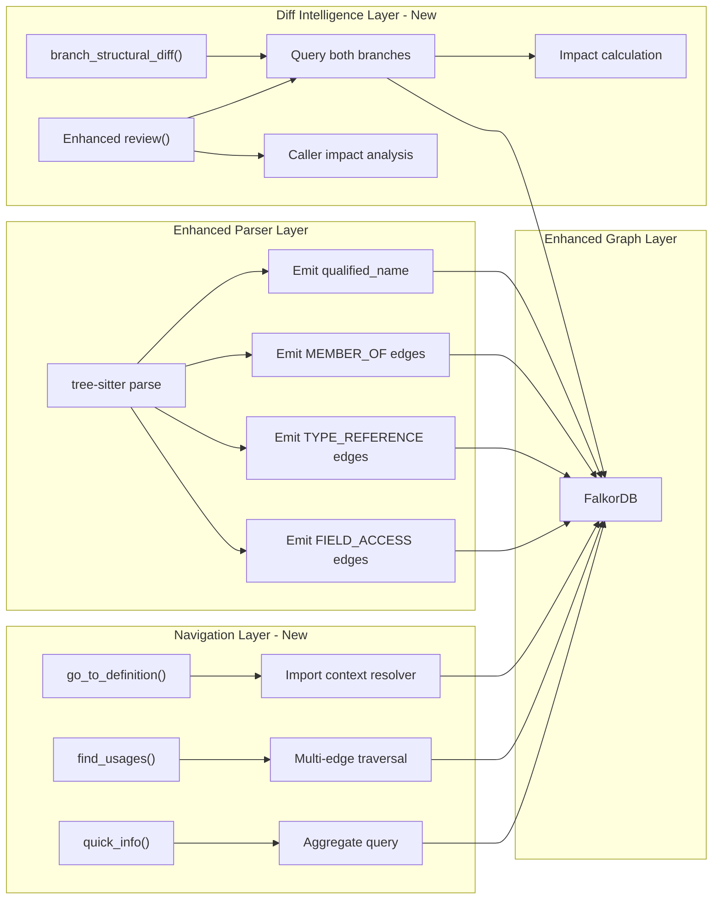

# Phase 3: SourceCraft-Level Navigation

> Implementation spec for go-to-definition, find-usages, quick-info, branch-aware structural diff, and PR-aware code review -- comparable to SourceCraft.dev features.

## Problem Statement

SourceCraft.dev provides fast code navigation: "go to declaration," "find usages," and "quick info" across an entire codebase with branch and PR awareness. Cortex currently has graph-based call analysis but lacks:

- **Type-qualified go-to-definition**: symbol lookup is name-based only (`f.name CONTAINS $pattern`). No type qualification, scope resolution, or overload disambiguation. `DefinedIn` edges exist but there is no API that resolves "which definition does this usage refer to?"
- **Comprehensive find-usages**: `Analyzer::callers()` works for functions only. No coverage for types, traits, constants, fields, or variables used across files.
- **Quick info**: `source` and `docstring` are stored on `CodeNode` but there is no structured endpoint returning signature + type + usage stats + complexity in one call.
- **Branch structural diff**: `project branch-diff` shows git-level file changes (ahead/behind commits, changed files) but not which symbols changed, what their impact is, or how the call graph differs.
- **PR-aware review with code intelligence**: `ReviewAnalyzer` runs per-file smell detection on diff hunks. It does not use the graph to show callers affected by changes, new dead code introduced, or dependency chain impact.

## Architecture



---

## 3.1 Type-Qualified Symbol Resolution

### Goal

Store `qualified_name` on every `CodeNode` so that symbol resolution can distinguish between `module_a::Foo::bar` and `module_b::Foo::bar`.

### Changes to `crates/cortex-core/src/model.rs`

Add new edge kinds:

```rust
pub enum EdgeKind {
    // ... existing variants ...
    /// Method/field belongs to a type (class, struct, trait, enum)
    MemberOf,
    /// Type reference in annotations, parameters, return types
    TypeReference,
    /// Field access expression (e.g., obj.field)
    FieldAccess,
}
```

Add Cypher label mappings:

```rust
impl EdgeKind {
    pub fn cypher_rel_type(&self) -> &'static str {
        match self {
            // ... existing ...
            Self::MemberOf => "MEMBER_OF",
            Self::TypeReference => "TYPE_REFERENCE",
            Self::FieldAccess => "FIELD_ACCESS",
        }
    }
}
```

### Schema updates

**File:** `crates/cortex-graph/src/schema.rs`

Add indexes for the new relationship types and for `qualified_name`:

```rust
const NAVIGATION_SCHEMA_STATEMENTS: &[&str] = &[
    "CREATE INDEX ON :CodeNode(qualified_name);",
    "CREATE INDEX ON :Function(qualified_name);",
    "CREATE INDEX ON :Class(qualified_name);",
    "CREATE INDEX ON :Method(qualified_name);",
    "CREATE INDEX ON :Struct(qualified_name);",
];
```

Add to `ensure_constraints`:

```rust
pub async fn ensure_navigation_schema(client: &GraphClient) -> Result<()> {
    for stmt in NAVIGATION_SCHEMA_STATEMENTS {
        if let Err(e) = client.run(stmt).await {
            log::warn!("Navigation schema statement skipped: {} ({})", stmt, e);
        }
    }
    Ok(())
}
```

### Parser changes

For each language parser in `crates/cortex-parser/src/languages/`, enhance the tree-sitter visitor to:

1. **Compute `qualified_name`** from the AST parent chain.
2. **Emit `MemberOf` edges** from methods to their containing type.
3. **Emit `TypeReference` edges** from type annotations to type definitions.
4. **Emit `FieldAccess` edges** from field access expressions to field definitions.

#### Rust parser example

**File:** `crates/cortex-parser/src/languages/rust.rs`

Qualified name computation:

```rust
fn compute_qualified_name(
    module_path: &str,   // e.g., "crate::handlers"
    parent_type: Option<&str>,  // e.g., "UserService"
    symbol_name: &str,   // e.g., "get_user"
) -> String {
    match parent_type {
        Some(parent) => format!("{}::{}::{}", module_path, parent, symbol_name),
        None => format!("{}::{}", module_path, symbol_name),
    }
}
```

Module path derivation from file path:

```rust
fn file_path_to_module_path(file_path: &str, repo_root: &str) -> String {
    let relative = file_path
        .strip_prefix(repo_root)
        .unwrap_or(file_path)
        .trim_start_matches('/');

    // Convert path separators to :: and strip extension
    let without_ext = relative
        .strip_suffix(".rs")
        .or_else(|| relative.strip_suffix(".py"))
        .or_else(|| relative.strip_suffix(".ts"))
        .unwrap_or(relative);

    let module = without_ext
        .replace('/', "::")
        .replace("mod.rs", "")
        .replace("__init__.py", "")
        .replace("index.ts", "")
        .trim_end_matches("::")
        .to_string();

    if module.is_empty() { "root".to_string() } else { module }
}
```

When visiting `impl` blocks:

```rust
// When processing an impl block like `impl UserService { fn get_user(...) ... }`
fn visit_impl_item(
    &mut self,
    node: tree_sitter::Node,
    impl_type: &str,   // "UserService"
    module_path: &str,
) {
    // For each method in the impl:
    let method_node = CodeNode {
        id: format!("method:{}::{}::{}", module_path, impl_type, method_name),
        kind: EntityKind::Method,
        name: method_name.to_string(),
        // ...
        properties: {
            let mut props = HashMap::new();
            props.insert("qualified_name".to_string(),
                format!("{}::{}::{}", module_path, impl_type, method_name));
            props.insert("parent_type".to_string(), impl_type.to_string());
            props
        },
    };

    // Emit MEMBER_OF edge
    let member_edge = CodeEdge {
        from: method_node.id.clone(),
        to: format!("struct:{}::{}", module_path, impl_type),
        kind: EdgeKind::MemberOf,
        properties: HashMap::new(),
    };

    self.nodes.push(method_node);
    self.edges.push(member_edge);
}
```

When visiting type annotations:

```rust
// When processing `fn process(user: UserService) -> Result<Response>`
fn visit_type_annotation(
    &mut self,
    type_name: &str,       // "UserService"
    source_node_id: &str,  // ID of the function/parameter using this type
) {
    let type_ref_edge = CodeEdge {
        from: source_node_id.to_string(),
        to: format!("call_target:{}", type_name),  // resolved later
        kind: EdgeKind::TypeReference,
        properties: HashMap::new(),
    };
    self.edges.push(type_ref_edge);
}
```

### Enhanced `resolve_call_targets`

**File:** `crates/cortex-graph/src/client.rs`

Add a second resolution pass for type references:

```rust
pub async fn resolve_type_references(
    &self,
    repository_path: &str,
    branch: Option<&str>,
) -> Result<usize> {
    let branch_filter = branch
        .map(|_| " AND source.branch = $branch AND target.branch = $branch")
        .unwrap_or("");

    let cypher = format!(
        "MATCH (source)-[old:TYPE_REFERENCE]->(ct:CallTarget)
         WHERE source.repository_path = $repo
         WITH source, old, ct
         MATCH (target:CodeNode {{name: ct.name}})
         WHERE target.repository_path = $repo
           AND target.kind IN ['CLASS', 'STRUCT', 'TRAIT', 'INTERFACE', 'ENUM', 'TYPE_ALIAS']
           {branch_filter}
         MERGE (source)-[r:TYPE_REFERENCE]->(target)
         SET r.kind = 'TypeReference'
         DELETE old
         RETURN count(r) AS resolved"
    );

    let mut params = vec![("repo", repository_path.to_string())];
    if let Some(br) = branch {
        params.push(("branch", br.to_string()));
    }

    let rows = self.query_with_params(&cypher, params).await?;

    let mut resolved = 0usize;
    for row in rows {
        if let Some(count) = row.get("resolved").and_then(|v| v.as_u64()) {
            resolved += count as usize;
        }
    }

    Ok(resolved)
}
```

---

## 3.2 Precise "Go to Definition"

### New file: `crates/cortex-analyzer/src/navigation.rs`

```rust
use cortex_core::{EntityKind, Result};
use cortex_graph::GraphClient;
use serde::{Deserialize, Serialize};
use serde_json::Value;

#[derive(Debug, Clone, Serialize, Deserialize)]
pub struct DefinitionResult {
    pub name: String,
    pub qualified_name: Option<String>,
    pub kind: String,
    pub file_path: String,
    pub line_number: u32,
    pub confidence: DefinitionConfidence,
    pub source_preview: Option<String>,
}

#[derive(Debug, Clone, Copy, PartialEq, Eq, Serialize, Deserialize)]
#[serde(rename_all = "snake_case")]
pub enum DefinitionConfidence {
    /// Exact match via qualified name
    Exact,
    /// Matched via import context
    ImportResolved,
    /// Same-module match
    SameModule,
    /// Name match only (ambiguous)
    NameOnly,
}

pub struct NavigationEngine {
    graph: GraphClient,
    repository_path: String,
    branch: Option<String>,
}

impl NavigationEngine {
    pub fn new(
        graph: GraphClient,
        repository_path: String,
        branch: Option<String>,
    ) -> Self {
        Self { graph, repository_path, branch }
    }

    /// Resolve the definition(s) of a symbol used at a given location.
    ///
    /// Disambiguation strategy (highest to lowest confidence):
    /// 1. Qualified name exact match
    /// 2. Import context: check what the source file imports
    /// 3. Same module/file: definition in the same module
    /// 4. Same package: definition anywhere in the project
    pub async fn go_to_definition(
        &self,
        symbol: &str,
        from_file: &str,
        from_line: Option<u32>,
    ) -> Result<Vec<DefinitionResult>> {
        let mut results = Vec::new();

        // Strategy 1: Try qualified name match
        let qualified_results = self.find_by_qualified_name(symbol).await?;
        if !qualified_results.is_empty() {
            results.extend(qualified_results);
            return Ok(results);
        }

        // Strategy 2: Resolve via import context
        let import_results = self.resolve_via_imports(symbol, from_file).await?;
        if !import_results.is_empty() {
            results.extend(import_results);
            return Ok(results);
        }

        // Strategy 3: Same module/directory
        let module_results = self.find_in_same_module(symbol, from_file).await?;
        if !module_results.is_empty() {
            results.extend(module_results);
            return Ok(results);
        }

        // Strategy 4: Global name search (lowest confidence)
        let global_results = self.find_by_name_global(symbol).await?;
        results.extend(global_results);

        Ok(results)
    }
}
```

### Implementation of resolution strategies

```rust
impl NavigationEngine {
    async fn find_by_qualified_name(&self, qualified_name: &str) -> Result<Vec<DefinitionResult>> {
        let branch_clause = self.branch_where("n");
        let cypher = format!(
            "MATCH (n:CodeNode)
             WHERE n.repository_path = $repo
               AND n.qualified_name = $qname
               {branch_clause}
             RETURN n.name AS name, n.qualified_name AS qualified_name,
                    n.kind AS kind, n.path AS path, n.line_number AS line,
                    substring(coalesce(n.source, ''), 0, 200) AS preview
             LIMIT 5"
        );

        let rows = self.graph.query_with_params(
            &cypher,
            vec![("repo", self.repository_path.clone()), ("qname", qualified_name.to_string())],
        ).await?;

        Ok(rows.iter().filter_map(|r| self.parse_definition(r, DefinitionConfidence::Exact)).collect())
    }

    async fn resolve_via_imports(
        &self,
        symbol: &str,
        from_file: &str,
    ) -> Result<Vec<DefinitionResult>> {
        let branch_clause = self.branch_where("target");
        let cypher = format!(
            "MATCH (f:File {{path: $file_path}})-[:IMPORTS]->(m)
             WHERE f.repository_path = $repo
             WITH m.name AS imported_module
             MATCH (target:CodeNode {{name: $symbol}})
             WHERE target.repository_path = $repo
               AND target.path CONTAINS imported_module
               {branch_clause}
             RETURN target.name AS name, target.qualified_name AS qualified_name,
                    target.kind AS kind, target.path AS path,
                    target.line_number AS line,
                    substring(coalesce(target.source, ''), 0, 200) AS preview
             LIMIT 10"
        );

        let rows = self.graph.query_with_params(
            &cypher,
            vec![
                ("repo", self.repository_path.clone()),
                ("file_path", from_file.to_string()),
                ("symbol", symbol.to_string()),
            ],
        ).await?;

        Ok(rows.iter().filter_map(|r| self.parse_definition(r, DefinitionConfidence::ImportResolved)).collect())
    }

    async fn find_in_same_module(
        &self,
        symbol: &str,
        from_file: &str,
    ) -> Result<Vec<DefinitionResult>> {
        // Extract directory from from_file as the module boundary
        let module_dir = from_file
            .rsplit_once('/')
            .map(|(dir, _)| dir)
            .unwrap_or("");

        let branch_clause = self.branch_where("n");
        let cypher = format!(
            "MATCH (n:CodeNode {{name: $symbol}})
             WHERE n.repository_path = $repo
               AND n.path STARTS WITH $module_dir
               {branch_clause}
             RETURN n.name AS name, n.qualified_name AS qualified_name,
                    n.kind AS kind, n.path AS path, n.line_number AS line,
                    substring(coalesce(n.source, ''), 0, 200) AS preview
             ORDER BY n.path
             LIMIT 10"
        );

        let rows = self.graph.query_with_params(
            &cypher,
            vec![
                ("repo", self.repository_path.clone()),
                ("symbol", symbol.to_string()),
                ("module_dir", module_dir.to_string()),
            ],
        ).await?;

        Ok(rows.iter().filter_map(|r| self.parse_definition(r, DefinitionConfidence::SameModule)).collect())
    }

    async fn find_by_name_global(&self, symbol: &str) -> Result<Vec<DefinitionResult>> {
        let branch_clause = self.branch_where("n");
        let cypher = format!(
            "MATCH (n:CodeNode {{name: $symbol}})
             WHERE n.repository_path = $repo
               {branch_clause}
               AND n.kind IN ['FUNCTION', 'METHOD', 'CLASS', 'STRUCT', 'TRAIT',
                              'INTERFACE', 'ENUM', 'TYPE_ALIAS', 'CONSTANT', 'VARIABLE']
             RETURN n.name AS name, n.qualified_name AS qualified_name,
                    n.kind AS kind, n.path AS path, n.line_number AS line,
                    substring(coalesce(n.source, ''), 0, 200) AS preview
             ORDER BY n.path
             LIMIT 20"
        );

        let rows = self.graph.query_with_params(
            &cypher,
            vec![("repo", self.repository_path.clone()), ("symbol", symbol.to_string())],
        ).await?;

        Ok(rows.iter().filter_map(|r| self.parse_definition(r, DefinitionConfidence::NameOnly)).collect())
    }

    fn branch_where(&self, node_var: &str) -> String {
        match &self.branch {
            Some(_) => format!("AND {}.branch = $branch", node_var),
            None => String::new(),
        }
    }

    fn parse_definition(&self, row: &Value, confidence: DefinitionConfidence) -> Option<DefinitionResult> {
        Some(DefinitionResult {
            name: row.get("name")?.as_str()?.to_string(),
            qualified_name: row.get("qualified_name").and_then(|v| v.as_str()).map(String::from),
            kind: row.get("kind")?.as_str()?.to_string(),
            file_path: row.get("path")?.as_str()?.to_string(),
            line_number: row.get("line")?.as_u64()? as u32,
            confidence,
            source_preview: row.get("preview").and_then(|v| v.as_str()).map(String::from),
        })
    }
}
```

### CLI command

**File:** `crates/cortex-cli/src/main.rs`

Add a new top-level command:

```rust
/// Go to definition of a symbol
Goto {
    /// Symbol name to look up
    symbol: String,
    /// Source file (for import context resolution)
    #[arg(long)]
    from_file: Option<String>,
    /// Source line number
    #[arg(long)]
    from_line: Option<u32>,
},
```

---

## 3.3 Comprehensive "Find Usages"

### New types

**File:** `crates/cortex-analyzer/src/navigation.rs`

```rust
#[derive(Debug, Clone, Serialize, Deserialize)]
pub struct UsageResult {
    pub symbol_name: String,
    pub usage_kind: UsageKind,
    pub file_path: String,
    pub line_number: u32,
    pub context_name: String,  // enclosing function/class name
    pub source_snippet: Option<String>,
}

#[derive(Debug, Clone, Copy, PartialEq, Eq, Serialize, Deserialize)]
#[serde(rename_all = "snake_case")]
pub enum UsageKind {
    /// Function/method call
    Call,
    /// Import statement
    Import,
    /// Type annotation / parameter type
    TypeReference,
    /// Field access
    FieldAccess,
    /// Inheritance (extends/implements)
    Inheritance,
    /// Trait implementation
    Implementation,
    /// Generic reference (Uses edge)
    Reference,
}
```

### Implementation

```rust
impl NavigationEngine {
    /// Find all usages of a symbol across the project.
    /// Traverses CALLS, IMPORTS, TYPE_REFERENCE, FIELD_ACCESS,
    /// INHERITS, IMPLEMENTS, REFERENCES, and USES edges.
    pub async fn find_usages(
        &self,
        symbol: &str,
        kind_filter: Option<EntityKind>,
    ) -> Result<Vec<UsageResult>> {
        let mut usages = Vec::new();

        // 1. Find callers (CALLS edges)
        usages.extend(self.find_call_usages(symbol).await?);

        // 2. Find importers (IMPORTS edges)
        usages.extend(self.find_import_usages(symbol).await?);

        // 3. Find type references (TYPE_REFERENCE edges)
        usages.extend(self.find_type_reference_usages(symbol).await?);

        // 4. Find field accesses (FIELD_ACCESS edges)
        usages.extend(self.find_field_access_usages(symbol).await?);

        // 5. Find inheritance (INHERITS edges)
        usages.extend(self.find_inheritance_usages(symbol).await?);

        // 6. Find implementations (IMPLEMENTS edges)
        usages.extend(self.find_implementation_usages(symbol).await?);

        // 7. Find generic references (REFERENCES, USES edges)
        usages.extend(self.find_generic_reference_usages(symbol).await?);

        // Deduplicate by (file_path, line_number, usage_kind)
        usages.sort_by(|a, b| {
            a.file_path.cmp(&b.file_path)
                .then_with(|| a.line_number.cmp(&b.line_number))
                .then_with(|| format!("{:?}", a.usage_kind).cmp(&format!("{:?}", b.usage_kind)))
        });
        usages.dedup_by(|a, b| {
            a.file_path == b.file_path
                && a.line_number == b.line_number
                && a.usage_kind == b.usage_kind
        });

        Ok(usages)
    }

    async fn find_call_usages(&self, symbol: &str) -> Result<Vec<UsageResult>> {
        let branch_clause = self.branch_where("caller");
        let cypher = format!(
            "MATCH (caller)-[:CALLS]->(target {{name: $symbol}})
             WHERE caller.repository_path = $repo
               {branch_clause}
             RETURN caller.name AS context_name, caller.path AS file_path,
                    caller.line_number AS line,
                    substring(coalesce(caller.source, ''), 0, 150) AS snippet
             ORDER BY caller.path, caller.line_number
             LIMIT 200"
        );

        let rows = self.graph.query_with_params(
            &cypher,
            vec![("repo", self.repository_path.clone()), ("symbol", symbol.to_string())],
        ).await?;

        Ok(rows.iter().filter_map(|r| {
            Some(UsageResult {
                symbol_name: symbol.to_string(),
                usage_kind: UsageKind::Call,
                file_path: r.get("file_path")?.as_str()?.to_string(),
                line_number: r.get("line")?.as_u64()? as u32,
                context_name: r.get("context_name")?.as_str()?.to_string(),
                source_snippet: r.get("snippet").and_then(|v| v.as_str()).map(String::from),
            })
        }).collect())
    }

    async fn find_type_reference_usages(&self, symbol: &str) -> Result<Vec<UsageResult>> {
        let branch_clause = self.branch_where("source");
        let cypher = format!(
            "MATCH (source)-[:TYPE_REFERENCE]->(target {{name: $symbol}})
             WHERE source.repository_path = $repo
               {branch_clause}
             RETURN source.name AS context_name, source.path AS file_path,
                    source.line_number AS line,
                    substring(coalesce(source.source, ''), 0, 150) AS snippet
             ORDER BY source.path, source.line_number
             LIMIT 200"
        );

        let rows = self.graph.query_with_params(
            &cypher,
            vec![("repo", self.repository_path.clone()), ("symbol", symbol.to_string())],
        ).await?;

        Ok(rows.iter().filter_map(|r| {
            Some(UsageResult {
                symbol_name: symbol.to_string(),
                usage_kind: UsageKind::TypeReference,
                file_path: r.get("file_path")?.as_str()?.to_string(),
                line_number: r.get("line")?.as_u64()? as u32,
                context_name: r.get("context_name")?.as_str()?.to_string(),
                source_snippet: r.get("snippet").and_then(|v| v.as_str()).map(String::from),
            })
        }).collect())
    }

    // find_import_usages, find_field_access_usages, find_inheritance_usages,
    // find_implementation_usages, find_generic_reference_usages follow the
    // same pattern with the appropriate edge type in the MATCH clause.
}
```

### CLI command

```rust
/// Find all usages of a symbol across the project
Usages {
    /// Symbol name to find usages for
    symbol: String,
    /// Filter by usage kind (call, import, type-reference, field-access, inheritance, implementation)
    #[arg(long)]
    kind: Option<String>,
},
```

---

## 3.4 "Quick Info" Endpoint

### Types

**File:** `crates/cortex-analyzer/src/navigation.rs`

```rust
#[derive(Debug, Clone, Serialize, Deserialize)]
pub struct QuickInfo {
    pub name: String,
    pub qualified_name: Option<String>,
    pub kind: String,
    pub signature: Option<String>,
    pub docstring: Option<String>,
    pub defined_in: DefinitionLocation,
    pub visibility: Option<String>,
    pub language: Option<String>,
    pub metrics: QuickInfoMetrics,
    pub parent_type: Option<String>,
}

#[derive(Debug, Clone, Serialize, Deserialize)]
pub struct DefinitionLocation {
    pub file_path: String,
    pub line_number: u32,
    pub module_path: Option<String>,
}

#[derive(Debug, Clone, Serialize, Deserialize)]
pub struct QuickInfoMetrics {
    pub usage_count: u32,
    pub caller_count: u32,
    pub callee_count: u32,
    pub complexity: Option<u32>,
    pub line_count: Option<u32>,
}
```

### Implementation

```rust
impl NavigationEngine {
    /// Get structured information about a symbol: signature, docs,
    /// location, visibility, usage stats, and complexity.
    pub async fn quick_info(&self, symbol: &str) -> Result<Vec<QuickInfo>> {
        let branch_clause = self.branch_where("n");
        let cypher = format!(
            "MATCH (n:CodeNode {{name: $symbol}})
             WHERE n.repository_path = $repo
               {branch_clause}
             OPTIONAL MATCH (caller)-[:CALLS]->(n)
             WITH n, count(DISTINCT caller) AS caller_count
             OPTIONAL MATCH (n)-[:CALLS]->(callee)
             WITH n, caller_count, count(DISTINCT callee) AS callee_count
             OPTIONAL MATCH (user)-[:TYPE_REFERENCE|REFERENCES|USES|IMPORTS]->(n)
             WITH n, caller_count, callee_count, count(DISTINCT user) AS usage_count
             OPTIONAL MATCH (n)-[:MEMBER_OF]->(parent)
             RETURN n.name AS name,
                    n.qualified_name AS qualified_name,
                    n.kind AS kind,
                    coalesce(n.source, '') AS source,
                    n.docstring AS docstring,
                    n.path AS path,
                    n.line_number AS line,
                    coalesce(n.lang, '') AS language,
                    n.visibility AS visibility,
                    n.cyclomatic_complexity AS complexity,
                    caller_count,
                    callee_count,
                    usage_count,
                    parent.name AS parent_type
             ORDER BY n.path
             LIMIT 10"
        );

        let rows = self.graph.query_with_params(
            &cypher,
            vec![("repo", self.repository_path.clone()), ("symbol", symbol.to_string())],
        ).await?;

        Ok(rows.iter().filter_map(|r| {
            let source = r.get("source").and_then(|v| v.as_str()).unwrap_or("");
            let signature = extract_signature_from_source(source);

            Some(QuickInfo {
                name: r.get("name")?.as_str()?.to_string(),
                qualified_name: r.get("qualified_name").and_then(|v| v.as_str()).map(String::from),
                kind: r.get("kind")?.as_str()?.to_string(),
                signature,
                docstring: r.get("docstring").and_then(|v| v.as_str()).map(String::from),
                defined_in: DefinitionLocation {
                    file_path: r.get("path")?.as_str()?.to_string(),
                    line_number: r.get("line")?.as_u64()? as u32,
                    module_path: r.get("qualified_name")
                        .and_then(|v| v.as_str())
                        .and_then(|qn| qn.rsplit_once("::"))
                        .map(|(module, _)| module.to_string()),
                },
                visibility: r.get("visibility").and_then(|v| v.as_str()).map(String::from),
                language: r.get("language").and_then(|v| v.as_str()).map(String::from),
                metrics: QuickInfoMetrics {
                    usage_count: r.get("usage_count").and_then(|v| v.as_u64()).unwrap_or(0) as u32,
                    caller_count: r.get("caller_count").and_then(|v| v.as_u64()).unwrap_or(0) as u32,
                    callee_count: r.get("callee_count").and_then(|v| v.as_u64()).unwrap_or(0) as u32,
                    complexity: r.get("complexity").and_then(|v| v.as_u64()).map(|c| c as u32),
                    line_count: Some(source.lines().count() as u32),
                },
                parent_type: r.get("parent_type").and_then(|v| v.as_str()).map(String::from),
            })
        }).collect())
    }
}

/// Extract the first line (signature) from a function/method source.
fn extract_signature_from_source(source: &str) -> Option<String> {
    let first_line = source.lines().next()?;
    if first_line.trim().is_empty() {
        return None;
    }

    // For multi-line signatures, collect until opening brace or colon
    let mut sig = String::new();
    for line in source.lines() {
        sig.push_str(line.trim());
        sig.push(' ');
        if line.contains('{') || line.contains(':') && !line.contains("::") {
            break;
        }
    }

    let sig = sig
        .split('{')
        .next()
        .unwrap_or(&sig)
        .trim()
        .to_string();

    if sig.is_empty() { None } else { Some(sig) }
}
```

### CLI command

```rust
/// Get quick info about a symbol (signature, docs, metrics)
Info {
    /// Symbol name
    symbol: String,
},
```

---

## 3.5 Branch Structural Diff

### Types

**File:** `crates/cortex-analyzer/src/navigation.rs`

```rust
#[derive(Debug, Clone, Serialize, Deserialize)]
pub struct BranchStructuralDiff {
    pub source_branch: String,
    pub target_branch: String,
    pub repository_path: String,
    pub added_symbols: Vec<SymbolDiffEntry>,
    pub removed_symbols: Vec<SymbolDiffEntry>,
    pub modified_symbols: Vec<ModifiedSymbolEntry>,
    pub impact: Vec<ImpactEntry>,
    pub summary: StructuralDiffSummary,
}

#[derive(Debug, Clone, Serialize, Deserialize)]
pub struct SymbolDiffEntry {
    pub name: String,
    pub qualified_name: Option<String>,
    pub kind: String,
    pub file_path: String,
    pub line_number: u32,
}

#[derive(Debug, Clone, Serialize, Deserialize)]
pub struct ModifiedSymbolEntry {
    pub name: String,
    pub kind: String,
    pub file_path: String,
    pub source_line: u32,
    pub target_line: u32,
    /// What changed: signature, body, both
    pub change_type: String,
}

#[derive(Debug, Clone, Serialize, Deserialize)]
pub struct ImpactEntry {
    pub changed_symbol: String,
    pub affected_symbol: String,
    pub affected_file: String,
    pub relationship: String,  // "calls", "inherits", "imports", etc.
    pub impact_level: String,  // "direct", "transitive"
}

#[derive(Debug, Clone, Serialize, Deserialize)]
pub struct StructuralDiffSummary {
    pub total_added: usize,
    pub total_removed: usize,
    pub total_modified: usize,
    pub total_affected_callers: usize,
    pub affected_files: usize,
}
```

### Implementation

```rust
impl NavigationEngine {
    /// Compare the symbol graph between two branches.
    /// Shows added, removed, and modified symbols with impact analysis.
    pub async fn branch_structural_diff(
        &self,
        source_branch: &str,
        target_branch: &str,
    ) -> Result<BranchStructuralDiff> {
        // 1. Find symbols in source but not in target (added)
        let added = self.find_branch_only_symbols(source_branch, target_branch).await?;

        // 2. Find symbols in target but not in source (removed)
        let removed = self.find_branch_only_symbols(target_branch, source_branch).await?;

        // 3. Find symbols in both but with different source content (modified)
        let modified = self.find_modified_symbols(source_branch, target_branch).await?;

        // 4. For each modified/added/removed symbol, find affected callers on target branch
        let mut impact = Vec::new();
        for sym in modified.iter().chain(removed.iter().map(|s| {
            // Convert SymbolDiffEntry to reference for impact analysis
            // (modified symbols use their name for lookup)
            s
        })) {
            let affected = self.find_affected_by_change(&sym.name, target_branch).await?;
            impact.extend(affected);
        }

        let affected_files: std::collections::HashSet<&str> = impact
            .iter()
            .map(|i| i.affected_file.as_str())
            .collect();

        let summary = StructuralDiffSummary {
            total_added: added.len(),
            total_removed: removed.len(),
            total_modified: modified.len(),
            total_affected_callers: impact.len(),
            affected_files: affected_files.len(),
        };

        Ok(BranchStructuralDiff {
            source_branch: source_branch.to_string(),
            target_branch: target_branch.to_string(),
            repository_path: self.repository_path.clone(),
            added_symbols: added,
            removed_symbols: removed,
            modified_symbols: modified,
            impact,
            summary,
        })
    }

    async fn find_branch_only_symbols(
        &self,
        branch_a: &str,
        branch_b: &str,
    ) -> Result<Vec<SymbolDiffEntry>> {
        let cypher =
            "MATCH (a:CodeNode)
             WHERE a.repository_path = $repo
               AND a.branch = $branch_a
               AND a.kind IN ['FUNCTION', 'METHOD', 'CLASS', 'STRUCT', 'TRAIT', 'ENUM']
               AND NOT EXISTS {
                 MATCH (b:CodeNode {name: a.name, kind: a.kind, branch: $branch_b})
                 WHERE b.repository_path = $repo
               }
             RETURN a.name AS name, a.qualified_name AS qualified_name,
                    a.kind AS kind, a.path AS path, a.line_number AS line
             ORDER BY a.path, a.name
             LIMIT 500";

        let rows = self.graph.query_with_params(
            cypher,
            vec![
                ("repo", self.repository_path.clone()),
                ("branch_a", branch_a.to_string()),
                ("branch_b", branch_b.to_string()),
            ],
        ).await?;

        Ok(rows.iter().filter_map(|r| {
            Some(SymbolDiffEntry {
                name: r.get("name")?.as_str()?.to_string(),
                qualified_name: r.get("qualified_name").and_then(|v| v.as_str()).map(String::from),
                kind: r.get("kind")?.as_str()?.to_string(),
                file_path: r.get("path")?.as_str()?.to_string(),
                line_number: r.get("line")?.as_u64()? as u32,
            })
        }).collect())
    }

    async fn find_modified_symbols(
        &self,
        source_branch: &str,
        target_branch: &str,
    ) -> Result<Vec<ModifiedSymbolEntry>> {
        let cypher =
            "MATCH (s:CodeNode)
             WHERE s.repository_path = $repo
               AND s.branch = $source
               AND s.kind IN ['FUNCTION', 'METHOD', 'CLASS', 'STRUCT']
             MATCH (t:CodeNode {name: s.name, kind: s.kind, branch: $target})
             WHERE t.repository_path = $repo
               AND s.source <> t.source
             RETURN s.name AS name, s.kind AS kind, s.path AS path,
                    s.line_number AS source_line, t.line_number AS target_line,
                    s.source AS source_code, t.source AS target_code
             ORDER BY s.path, s.name
             LIMIT 200";

        let rows = self.graph.query_with_params(
            cypher,
            vec![
                ("repo", self.repository_path.clone()),
                ("source", source_branch.to_string()),
                ("target", target_branch.to_string()),
            ],
        ).await?;

        Ok(rows.iter().filter_map(|r| {
            let source_code = r.get("source_code").and_then(|v| v.as_str()).unwrap_or("");
            let target_code = r.get("target_code").and_then(|v| v.as_str()).unwrap_or("");
            let source_sig = extract_signature_from_source(source_code);
            let target_sig = extract_signature_from_source(target_code);
            let change_type = if source_sig != target_sig { "signature" } else { "body" };

            Some(ModifiedSymbolEntry {
                name: r.get("name")?.as_str()?.to_string(),
                kind: r.get("kind")?.as_str()?.to_string(),
                file_path: r.get("path")?.as_str()?.to_string(),
                source_line: r.get("source_line")?.as_u64()? as u32,
                target_line: r.get("target_line")?.as_u64()? as u32,
                change_type: change_type.to_string(),
            })
        }).collect())
    }

    async fn find_affected_by_change(
        &self,
        symbol_name: &str,
        on_branch: &str,
    ) -> Result<Vec<ImpactEntry>> {
        let cypher =
            "MATCH (caller)-[r:CALLS|IMPORTS|INHERITS|IMPLEMENTS|TYPE_REFERENCE]->(target {name: $symbol})
             WHERE caller.repository_path = $repo
               AND caller.branch = $branch
             RETURN caller.name AS affected_symbol, caller.path AS affected_file,
                    type(r) AS relationship
             ORDER BY caller.path
             LIMIT 100";

        let rows = self.graph.query_with_params(
            cypher,
            vec![
                ("repo", self.repository_path.clone()),
                ("symbol", symbol_name.to_string()),
                ("branch", on_branch.to_string()),
            ],
        ).await?;

        Ok(rows.iter().filter_map(|r| {
            Some(ImpactEntry {
                changed_symbol: symbol_name.to_string(),
                affected_symbol: r.get("affected_symbol")?.as_str()?.to_string(),
                affected_file: r.get("affected_file")?.as_str()?.to_string(),
                relationship: r.get("relationship")?.as_str()?.to_string(),
                impact_level: "direct".to_string(),
            })
        }).collect())
    }
}
```

### CLI enhancement

Enhance the existing `AnalyzeCommand::BranchDiff`:

```rust
BranchDiff {
    source: String,
    target: String,
    #[arg(long)]
    path: Option<PathBuf>,
    #[arg(long, default_value_t = 50)]
    commit_limit: usize,
    /// Include symbol-level structural diff (requires both branches indexed)
    #[arg(long)]
    structural: bool,
    #[command(flatten)]
    filters: AnalyzeFilterArgs,
},
```

When `--structural` is passed, after the existing git-level diff, also run `NavigationEngine::branch_structural_diff()` and append the structural results.

---

## 3.6 PR-Aware Review with Code Intelligence

### File: `crates/cortex-analyzer/src/review.rs`

Enhance `ReviewAnalyzer` to optionally accept graph context:

```rust
use crate::navigation::NavigationEngine;

impl ReviewAnalyzer {
    /// Enhanced review that uses the code graph for impact analysis.
    pub async fn analyze_with_graph(
        &self,
        input: &ReviewInput,
        nav: &NavigationEngine,
    ) -> ReviewReport {
        // 1. Run existing per-file smell + refactoring analysis
        let mut report = self.analyze(input);

        // 2. For each changed function, find callers that may be affected
        let mut impact_findings: Vec<ReviewSmellFinding> = Vec::new();
        for file in &input.files {
            let changed_functions = extract_changed_function_names(&file.source, &file.changed_ranges);
            for func_name in &changed_functions {
                if let Ok(affected) = nav.find_usages(func_name, None).await {
                    let caller_count = affected.len();
                    if caller_count > 0 {
                        impact_findings.push(ReviewSmellFinding {
                            file_path: file.path.clone(),
                            line_number: find_function_line(&file.source, func_name).unwrap_or(0),
                            severity: if caller_count > 10 { Severity::Warning } else { Severity::Info },
                            smell_type: "impact_warning".to_string(),
                            symbol_name: func_name.clone(),
                            message: format!(
                                "Changed function '{}' has {} callers across the project that may be affected",
                                func_name, caller_count
                            ),
                            in_changed_lines: true,
                        });
                    }
                }
            }
        }

        // 3. Check for newly introduced dead code
        // (functions added in this diff that have no callers)
        for file in &input.files {
            let new_functions = extract_new_function_names(&file.source, &file.changed_ranges);
            for func_name in &new_functions {
                if let Ok(usages) = nav.find_usages(func_name, None).await {
                    if usages.is_empty() {
                        impact_findings.push(ReviewSmellFinding {
                            file_path: file.path.clone(),
                            line_number: find_function_line(&file.source, func_name).unwrap_or(0),
                            severity: Severity::Info,
                            smell_type: "new_dead_code".to_string(),
                            symbol_name: func_name.clone(),
                            message: format!(
                                "New function '{}' has no callers yet. Verify it will be used.",
                                func_name
                            ),
                            in_changed_lines: true,
                        });
                    }
                }
            }
        }

        // 4. Append impact findings to the report
        report.smells.extend(impact_findings);
        report.summary.smell_findings_total = report.smells.len();
        report.summary.smell_findings_returned = report.smells.len();

        report
    }
}
```

---

## 3.7 MCP Tools for Navigation

### File: `crates/cortex-mcp/src/handler.rs`

```rust
#[tool(
    description = "Go to the definition of a symbol. Returns file path and line number. Uses import context for disambiguation when from_file is provided."
)]
async fn go_to_definition(
    &self,
    Parameters(req): Parameters<GoToDefReq>,
) -> Result<CallToolResult, McpError> {
    let graph = self.graph_client().await?;
    let (repo_path, branch) = self.resolve_project_context()?;
    let nav = NavigationEngine::new(graph, repo_path, branch);
    let results = nav
        .go_to_definition(&req.symbol, req.from_file.as_deref().unwrap_or(""), req.from_line)
        .await
        .map_err(|e| McpError::internal_error(e.to_string(), None))?;
    Ok(Self::ok(serde_json::to_string_pretty(&results).unwrap_or_default()))
}

#[tool(
    description = "Find all usages of a symbol across the project. Returns call sites, type references, imports, inheritance, and implementations."
)]
async fn find_all_usages(
    &self,
    Parameters(req): Parameters<FindUsagesReq>,
) -> Result<CallToolResult, McpError> {
    let graph = self.graph_client().await?;
    let (repo_path, branch) = self.resolve_project_context()?;
    let nav = NavigationEngine::new(graph, repo_path, branch);
    let results = nav
        .find_usages(&req.symbol, None)
        .await
        .map_err(|e| McpError::internal_error(e.to_string(), None))?;
    Ok(Self::ok(serde_json::to_string_pretty(&results).unwrap_or_default()))
}

#[tool(
    description = "Get quick information about a symbol: signature, documentation, location, visibility, usage count, caller count, and complexity."
)]
async fn quick_info(
    &self,
    Parameters(req): Parameters<QuickInfoReq>,
) -> Result<CallToolResult, McpError> {
    let graph = self.graph_client().await?;
    let (repo_path, branch) = self.resolve_project_context()?;
    let nav = NavigationEngine::new(graph, repo_path, branch);
    let results = nav
        .quick_info(&req.symbol)
        .await
        .map_err(|e| McpError::internal_error(e.to_string(), None))?;
    Ok(Self::ok(serde_json::to_string_pretty(&results).unwrap_or_default()))
}

#[tool(
    description = "Compare two branches at the symbol level. Shows added, removed, and modified symbols with impact analysis on callers. Requires both branches to be indexed."
)]
async fn branch_structural_diff(
    &self,
    Parameters(req): Parameters<BranchStructuralDiffReq>,
) -> Result<CallToolResult, McpError> {
    let graph = self.graph_client().await?;
    let (repo_path, _) = self.resolve_project_context()?;
    let nav = NavigationEngine::new(graph, repo_path, None);
    let result = nav
        .branch_structural_diff(&req.source_branch, &req.target_branch)
        .await
        .map_err(|e| McpError::internal_error(e.to_string(), None))?;
    Ok(Self::ok(serde_json::to_string_pretty(&result).unwrap_or_default()))
}

#[tool(
    description = "Enhanced code review with impact analysis. Runs smell detection on diff, plus shows callers affected by changes and flags new dead code."
)]
async fn pr_review(
    &self,
    Parameters(req): Parameters<PrReviewReq>,
) -> Result<CallToolResult, McpError> {
    let graph = self.graph_client().await?;
    let (repo_path, branch) = self.resolve_project_context()?;
    let nav = NavigationEngine::new(graph, repo_path, branch);
    let reviewer = ReviewAnalyzer::new();

    // Build ReviewInput from request...
    let input = build_review_input_from_req(&req)?;
    let report = reviewer.analyze_with_graph(&input, &nav).await;

    Ok(Self::ok(serde_json::to_string_pretty(&report).unwrap_or_default()))
}
```

### Helper method on `CortexHandler`

```rust
impl CortexHandler {
    fn resolve_project_context(&self) -> Result<(String, Option<String>), McpError> {
        let project_ref = self.projects.get_current_project()
            .ok_or_else(|| McpError::invalid_params(
                "No current project set. Use set_current_project first.", None
            ))?;
        Ok((
            project_ref.path.display().to_string(),
            Some(project_ref.branch),
        ))
    }
}
```

### Register in `tool_names()`

```rust
pub fn tool_names() -> &'static [&'static str] {
    &[
        // ... existing tools ...
        "go_to_definition",
        "find_all_usages",
        "quick_info",
        "branch_structural_diff",
        "pr_review",
    ]
}
```

### MCP request types

```rust
#[derive(Debug, Deserialize, JsonSchema)]
struct GoToDefReq {
    symbol: String,
    from_file: Option<String>,
    from_line: Option<u32>,
}

#[derive(Debug, Deserialize, JsonSchema)]
struct FindUsagesReq {
    symbol: String,
    kind: Option<String>,  // "call", "import", "type-reference", etc.
}

#[derive(Debug, Deserialize, JsonSchema)]
struct QuickInfoReq {
    symbol: String,
}

#[derive(Debug, Deserialize, JsonSchema)]
struct BranchStructuralDiffReq {
    source_branch: String,
    target_branch: String,
}

#[derive(Debug, Deserialize, JsonSchema)]
struct PrReviewReq {
    base_ref: Option<String>,
    head_ref: Option<String>,
    path: Option<String>,
    min_severity: Option<String>,
    max_findings: Option<usize>,
}
```

---

## Files Summary

| File | Change Type | Description |
|------|-------------|-------------|
| `crates/cortex-core/src/model.rs` | Edit | Add `MemberOf`, `TypeReference`, `FieldAccess` to `EdgeKind` |
| `crates/cortex-graph/src/schema.rs` | Edit | Add `NAVIGATION_SCHEMA_STATEMENTS`, `ensure_navigation_schema()` |
| `crates/cortex-graph/src/client.rs` | Edit | Add `resolve_type_references()` method |
| `crates/cortex-parser/src/languages/rust.rs` | Edit | Emit `qualified_name`, `MemberOf`, `TypeReference` edges |
| `crates/cortex-parser/src/languages/python.rs` | Edit | Same parser enhancements for Python |
| `crates/cortex-parser/src/languages/typescript.rs` | Edit | Same parser enhancements for TypeScript |
| `crates/cortex-parser/src/languages/go.rs` | Edit | Same parser enhancements for Go |
| `crates/cortex-parser/src/languages/java.rs` | Edit | Same parser enhancements for Java |
| `crates/cortex-analyzer/src/navigation.rs` | New | `NavigationEngine` with `go_to_definition`, `find_usages`, `quick_info`, `branch_structural_diff` |
| `crates/cortex-analyzer/src/lib.rs` | Edit | Add `pub mod navigation` and re-exports |
| `crates/cortex-analyzer/src/review.rs` | Edit | Add `analyze_with_graph()` to `ReviewAnalyzer` |
| `crates/cortex-cli/src/main.rs` | Edit | Add `Goto`, `Usages`, `Info` commands; enhance `BranchDiff` with `--structural` |
| `crates/cortex-mcp/src/handler.rs` | Edit | Add 5 new navigation MCP tools |
| `crates/cortex-mcp/src/lib.rs` | Edit | Add new tool names to `tool_names()` |

---

## Implementation Priority

Phase 3 should be implemented in this order to maximize incremental value:

1. **3.4 Quick Info** (smallest change, immediately useful, no parser changes needed)
2. **3.3 Find Usages** (uses existing edge types, high value for code review)
3. **3.2 Go to Definition** (needs import context queries but no parser changes for basic version)
4. **3.1 Type-Qualified Symbols** (parser changes required, enhances all above)
5. **3.5 Branch Structural Diff** (requires both branches indexed)
6. **3.6 PR-Aware Review** (builds on find-usages + review)
7. **3.7 MCP Tools** (can be registered incrementally as each feature lands)

---

## Test Plan

### Unit tests

| Test | File | What it verifies |
|------|------|------------------|
| `test_go_to_def_qualified` | `navigation.rs` | Qualified name match returns Exact confidence |
| `test_go_to_def_import_resolved` | `navigation.rs` | Import context narrows to correct definition |
| `test_go_to_def_same_module` | `navigation.rs` | Same-module match preferred over global |
| `test_go_to_def_fallback` | `navigation.rs` | Global name match with NameOnly confidence |
| `test_find_usages_calls` | `navigation.rs` | Call sites returned with UsageKind::Call |
| `test_find_usages_type_refs` | `navigation.rs` | Type annotations returned with UsageKind::TypeReference |
| `test_find_usages_dedup` | `navigation.rs` | Duplicate usages deduplicated |
| `test_quick_info_metrics` | `navigation.rs` | Caller/callee/usage counts correct |
| `test_branch_diff_added` | `navigation.rs` | Symbols only in source branch listed as added |
| `test_branch_diff_removed` | `navigation.rs` | Symbols only in target branch listed as removed |
| `test_branch_diff_modified` | `navigation.rs` | Changed source detected as modified |
| `test_branch_diff_impact` | `navigation.rs` | Callers of changed symbols listed in impact |
| `test_review_with_graph_impact` | `review.rs` | Changed function callers flagged |
| `test_review_new_dead_code` | `review.rs` | New function with no callers flagged |
| `test_extract_signature` | `navigation.rs` | Signature extraction from various languages |

### Integration tests

| Test | What it verifies |
|------|------------------|
| Index a Rust project, `cortex goto "main"` | Returns definition in main.rs |
| Index a project, `cortex usages "parse"` | Returns all call sites across files |
| Index a project, `cortex info "parse"` | Returns signature, docs, metrics |
| Index branch A and branch B, `cortex analyze branch-diff A B --structural` | Shows structural changes |
| Run `cortex analyze review --base main --head feature` on indexed project | Impact findings appear |

---

## Migration Notes

- New `EdgeKind` variants (`MemberOf`, `TypeReference`, `FieldAccess`) are additive; existing edges unchanged.
- `qualified_name` is stored in the `properties` map on `CodeNode` -- no schema migration needed, just a new index.
- Parser enhancements should be rolled out language by language (Rust first, then Python/TypeScript/Go/Java).
- Older indexed data (without `qualified_name`) will still work -- `go_to_definition` falls back to name-based matching.
- Navigation features work with existing `CALLS`/`IMPORTS`/`INHERITS`/`IMPLEMENTS` edges immediately. New edge types (`TYPE_REFERENCE`, `FIELD_ACCESS`, `MEMBER_OF`) enhance accuracy but are not required for the basic version.
- MCP tools are additive; no existing tools are modified.
- Branch structural diff requires both branches to be indexed. The CLI should check `is_branch_index_current` and warn/offer to index before running.

## Verification Commands

```bash
cargo check -p cortex-core
cargo check -p cortex-graph
cargo check -p cortex-parser
cargo check -p cortex-analyzer
cargo check -p cortex-cli
cargo check -p cortex-mcp
cargo test --workspace
cargo clippy --workspace -- -D warnings

# Navigation tests (require FalkorDB + indexed project)
cortex index .
cortex goto "main"
cortex usages "GraphClient"
cortex info "GraphClient"
cortex analyze branch-diff feature/nav main --structural
cortex analyze review --base main --head feature/nav
```
