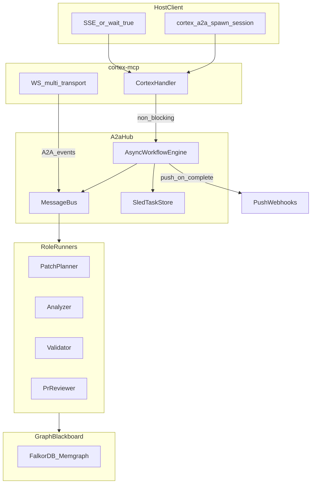

# A2A 100% completion design

Date: 2026-06-01  
Status: approved for implementation (plan `a2a_100%_completion`)

## Problem

CodeCortex MCP is a synchronous, asymmetric RPC provider. Host models linearly orchestrate expensive graph tools, causing token blow-up, lost-in-the-middle accuracy loss, and blocking latency on complex codebases.

## Target architecture

Hybrid **MCP + A2A**: host calls `cortex_a2a_spawn_session` once; sub-agents negotiate via in-process bus and graph blackboard; host receives bounded `FinalResult` via SSE, push, or optional `wait_for_completion`.

## 100% acceptance criteria

| Pillar | Acceptance | Evidence |
| --- | --- | --- |
| P2 Symmetric async | `AsyncWorkflowEngine`; parallel analyzer+validator; single index-promotion path | `workflow.rs`, `hub.rs`, `workflow_parallel` test |
| P3 Transport | WS `a2a_subscribe` fan-out; spawn non-blocking | `network_server.rs`, `a2a_ws_events` test |
| P4 Blackboard | All payload types write insights; graph consensus E2E | `services.rs`, `a2a_blackboard_payloads`, `transport.rs` fixture |
| P5 Ecosystem | A2A rule + hook; agent manifests; plugin sync | `codecortex-a2a.mdc`, `preflight-a2a-spawn.sh` |
| P6 Host meta-tool | `subscribe_url`, `wait_for_completion`; Cypher row guard | spawn response, `host_guard` config |
| P7 Tests | Deadlock E2E, network E2E, FalkorDB CI required | `a2a_consensus_deadlock`, `a2a_network_e2e`, CI job |
| Production | Sled task store; push production profile | `task_store/sled.rs`, `[profile.production]` |

## Out of scope

- pbjson in `proto.rs`
- Colon-style axum routes
- `delta_review` workflow alias
- Local 8B model arbitrage (documented operational pattern only)

## Related

- [docs/A2A.md](../../A2A.md)
- [docs/A2A_COMPLETENESS.md](../../A2A_COMPLETENESS.md)
- Plan: `.cursor/plans/a2a_100%_completion_bb76e7e8.plan.md`
