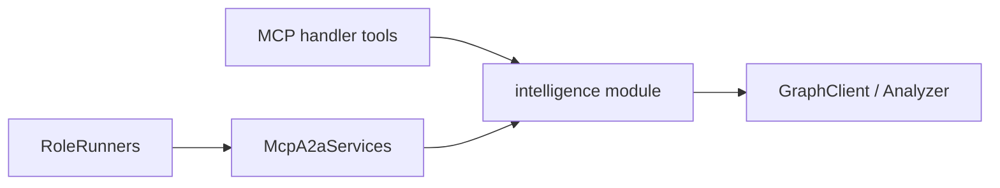

# A2A Indexed-Codebase Intelligence — Design Spec

**Date:** 2026-06-03  
**Status:** Approved for implementation (plan execution)

## Problem

A2A protocol integration is complete ([A2A_COMPLETENESS.md](../../A2A_COMPLETENESS.md)), but in-process roles use simplified graph queries via `a2a_facade.rs` instead of the same bounded intelligence as MCP tools (`get_patch_context`, `get_impact_graph`, etc.).

## Solution

Extract shared logic into `cortex-mcp/src/intelligence/` consumed by MCP handlers and `McpA2aServices`. Extend spawn parameters and `A2aServices` for branch/delta review. Generalize role runners to be task-driven; retain deadlock demo only when explicitly requested.

## Architecture

## Components

| Module | Responsibility |
| --- | --- |
| `intelligence::patch_context` | Token-bounded targets, contracts, likely tests |
| `intelligence::impact_graph` | Callers, transitive blast radius, budget truncation |
| `intelligence::delta_context` | Branch diff + impact hints when graph available |
| `intelligence::freshness` | Path-scoped index freshness from branch metadata |
| `intelligence::filters` | include/exclude path matching |

## Spawn API extensions (backward compatible)

- `source_branch`, `target_branch` — PR/delta workflows
- `target_symbol` — explicit graph symbol
- `exclude_paths`, `exclude_globs` — scope filters
- `mode` — patch intent (feature/bugfix/review)

## A2aServices extensions

- `get_delta_context(source, target, paths, budget)`
- `get_pr_review_summary(task, branches, paths, budget)`
- Path-scoped `index_freshness_for_paths`

## Runner behavior

- **PatchPlanner:** capsule-driven strategy; spin-lock demo only when task references `transport_deadlock` or `[a2a.workflows.consensus_review].demo_fixture = true`
- **Analyzer:** structured impact from intelligence module; no false stub on zero callers
- **PrReviewer:** uses delta context when branches set
- **Validator:** optional `require_fresh_index` config gate
- **Indexer:** publishes mutation + triggers freshness re-check

## Protocol surfacing

Workflow results include intelligence capsule URIs and summaries as task `artifacts` (JSON parts). AgentCard skills list real MCP tool ids.

## Testing

- Unit tests on intelligence module
- Existing `a2a_*` E2E + graph-backed assertions
- Semantic oracles: freshness field, impact summary tokens

## Gap memo (Phase 0)

| Gap | Severity |
| --- | --- |
| a2a_facade duplicates handler without excerpts/budget | High |
| pr_review lacks delta_context | High |
| Freshness ignores include_paths | Medium |
| Demo spin-lock strategies for all tasks | Medium |
| A2A audit oracles content-free | Medium |
